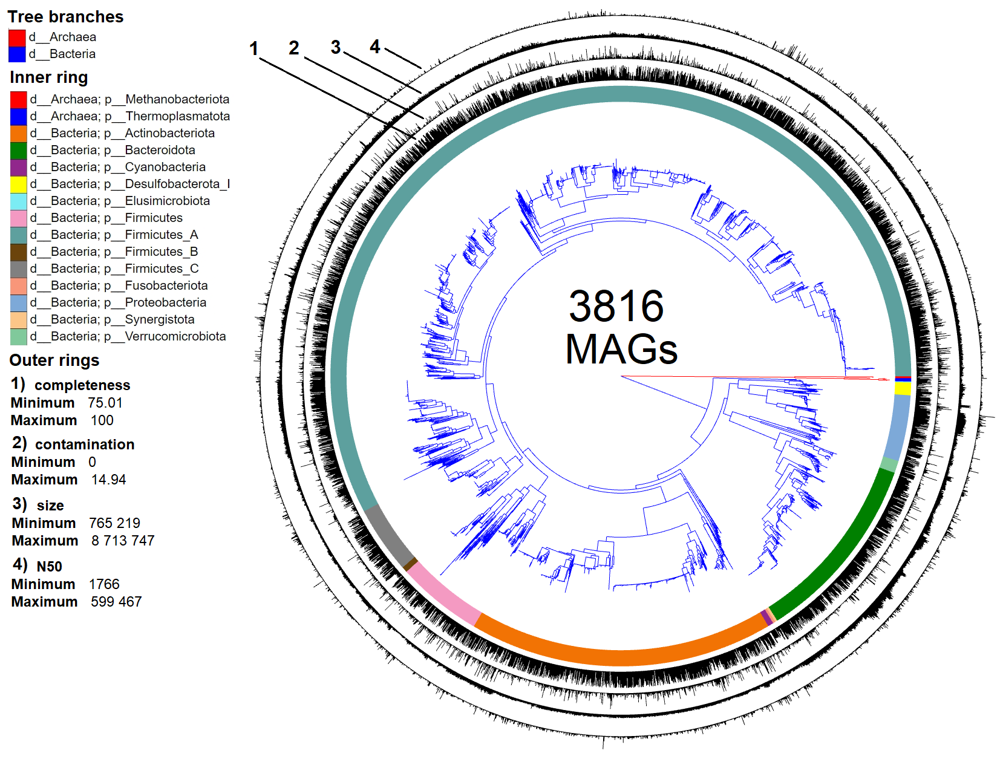

<p style="text-align: justify;">
This document provides the complete supplementary materials for the manuscript  
**Ecological and functional stratification of the stool microbiome predicts response to immune checkpoint inhibitors across cancer types**.  
All code, intermediate data, and results presented here are also available in the accompanying GitHub repository:  
[https://github.com/JeniaOle13/cancer-biomarkers](https://github.com/JeniaOle13/cancer-biomarkers) (DOI: [to be added]).

The repository contains the full Quarto document used to generate this supplementary information, along with all input data and scripts required to reproduce the analyses. The current file is intended as a self‑contained summary of the supplementary results and methods referenced in the main article.

For the full reproducible analysis, please refer to the Quarto source file and the data folder in the GitHub repository. For any questions, contact the corresponding author.
<p>

```{r}
#| include: false
library(vegan)
library(ggplot2)
library(ggpubr)
library(ggrepel)
library(ggdist)
library(scatterpie)
library(stringr)
library(RColorBrewer)
library(lmerTest)
library(multcomp)
library(fgsea)
library(hrbrthemes)
library(dplyr)
library(readr)
library(ggtree)
library(effectsize)
library(reshape2)
library(clusterProfiler)
library(GseaVis)
library(qqtest)
library(Maaslin2)
library(phyloseq)
library(UpSetR)
library(microViz)
library(zCompositions)
library(igraph)
library(tidygraph)
library(tidyverse)
library(ape)
library(philr)
library(MuMIn)
library(parameters)
library(predictmeans)
library(yardstick)
library(purrr)
library(tidymodels)
library(themis)
library(pROC)
library(recipeselectors)
library(DT)
library(downloadthis)
library(gridExtra)
library(grid)
library(gt)
library(tidyr)
library(rlang)
library(DescTools)
```

```{r}
#| include: false
datasets.statistic <- read.csv("data/datasets.statistic.tsv", sep = "\t")
```

```{r}
#| include: false
meta_data <- read.csv("data/meta_data.tsv", sep = "\t")
meta_data$cancer_type[meta_data$cancer_type != "Melanoma"] <- "Other"

meta_data_2 <- read.csv("data/meta_data-v2.tsv", sep = "\t")
```

```{r}
#| include: false
ogu_table <- read.csv("data/ogu_table.tsv", sep = "\t")
```

```{r}
#| include: false
rooted_tree <- read.tree("data/rooted_tree.nwk")
```

```{r}
#| include: false
taxonomy <- read.csv("data/taxonomy.tsv", sep = "\t", row.names = 1)

kingdom <- sapply(str_split(taxonomy$Taxon, ";"), function(x) x[1])
phylum <- sapply(str_split(taxonomy$Taxon, ";"), function(x) x[2])
class_t <- sapply(str_split(taxonomy$Taxon, ";"), function(x) x[3])
order_t <- sapply(str_split(taxonomy$Taxon, ";"), function(x) x[4])
family_t <- sapply(str_split(taxonomy$Taxon, ";"), function(x) x[5])

genus <- sapply(str_split(taxonomy$Taxon, ";"), function(x) x[6])
genus[genus == "g__"] <- paste0(family_t[which(genus == "g__")], "_unknown")

species <- sapply(str_split(taxonomy$Taxon, ";"), function(x) x[7])

kingdom <- sub("d__", "", kingdom)
phylum <- sub("p__", "", phylum)
class_t <- sub("c__", "", class_t)
order_t <- sub("o__", "", order_t)
family_t <- sub("f__", "", family_t)
genus <- sub("g__", "", genus)
species <- sub("s__", "", species)

species <- gsub(paste(paste0("_", LETTERS), collapse = "|"), "", species)
genus <- gsub(paste(paste0("_", LETTERS), collapse = "|"), "", genus)

tax_table <- data.frame(kingdom, phylum, class = class_t, order = order_t, family = family_t, genus, species)
rownames(tax_table) <- rownames(taxonomy)

tax_table$phylum <- sapply(str_split(tax_table$phylum, "_"), function(x) x[1])
tax_table <- tax_table[rownames(tax_table) %in% colnames(ogu_table),]
```

```{r}
#| include: false
statistic <- read.csv("data/statistic.tsv", sep = "\t")
```

```{r}
#| include: false
mag.statistic <- read.csv("data/mag.statistic.tsv", sep = "\t")
```

```{r}
#| include: false
ogu_table_t <- as.data.frame(t(ogu_table))
ogu_table_t <- cbind(featureid = rownames(ogu_table_t), ogu_table_t)
ogu_table_t <- merge(cbind(featureid = rownames(tax_table), tax_table), ogu_table_t, by = 1)
ogu_table_t <- ogu_table_t[-1]
```

```{r}
#| include: false
ogu.markers <- read.csv("data/ogu.biomarkers.tsv", sep = "\t")
ogu.markers <- merge(ogu.markers[c(2,1,3:6)], cbind(rownames(tax_table), tax_table), by = 1)
ogu.markers <- ogu.markers[ogu.markers$num_d_other > 0,]
```

```{r}
#| include: false
songbird_Frankel_2017 <- read.csv("data/songbird/Frankel_2017/differentials.tsv", sep = "\t")
songbird_Gopalakrishnan_2019 <- read.csv("data/songbird/Gopalakrishnan_2019/differentials.tsv", sep = "\t")
songbird_Matson_2019 <- read.csv("data/songbird/Matson_2019/differentials.tsv", sep = "\t")

songbird_Spencer_2021 <- read.csv("data/songbird/Spencer_2021/differentials.tsv", sep = "\t")
songbird_Lee_2022 <- read.csv("data/songbird/Lee_2022/differentials.tsv", sep = "\t")

songbird_Liu_2022 <- read.csv("data/songbird/Liu_2022/differentials.tsv", sep = "\t")
songbird_McCulloch_2022 <- read.csv("data/songbird/McCulloch_2022/differentials.tsv", sep = "\t")
songbird_Peng_2020 <- read.csv("data/songbird/Peng_2020/differentials.tsv", sep = "\t")
songbird_Tsakmaklis_2023 <- read.csv("data/songbird/Tsakmaklis_2023/differentials.tsv", sep = "\t")
songbird_Gunjur_2024 <- read.csv("data/songbird/Gunjur_2024/differentials.tsv", sep = "\t")
songbird_Heshiki_2020 <- read.csv("data/songbird/Heshiki_2020/differentials.tsv", sep = "\t")
```

```{r}
#| include: false
songbird_coef <- rbind(songbird_Frankel_2017, songbird_Gopalakrishnan_2019, songbird_Matson_2019,
      songbird_Spencer_2021, songbird_Lee_2022, songbird_Liu_2022, songbird_McCulloch_2022,
      songbird_Peng_2020, songbird_Tsakmaklis_2023, songbird_Gunjur_2024, songbird_Heshiki_2020)

songbird_coef <- songbird_coef %>% group_by(featureid) %>% summarise(mean = mean(response.T.R.), sd = sd(response.T.R.))
songbird_coef <- as.data.frame(songbird_coef)

ogu.markers <- merge(ogu.markers, songbird_coef, by = 1)
ogu.markers <- ogu.markers[order(ogu.markers$num_datasets, decreasing = T),]
rownames(ogu.markers) <- 1:nrow(ogu.markers)
```

```{r}
#| include: false
body_site <- read.csv("data/body_ogu.tsv", sep = "\t")[-2]
colnames(body_site)[2] <- "site"
body_site$genome <- sub(".fa", "", body_site$genome)

food <- read.csv("data/food_ogu.txt", sep = "\t", header = F)
colnames(food) <- "genome"
food$site <- "food"
food$genome <- sub(".fa", "", food$genome)

pathogens <- read.csv("data/pathogens_clusters.tsv", sep = "\t", header = T)
```

```{r}
#| include: false
#| warning: false
CAZy <- read.csv("data/CAZy.tsv", sep = "\t")
KEGG <- read.csv("data/KEGG.tsv", sep = "\t")

CAZy_sets <- read.csv("data/CAZy-sets.tsv", sep = "\t")
KEGG_sets <- read.csv("data/KEGG-sets.tsv", sep = "\t")
```

# Datasets
```{r}
#| echo: false
#| message: false
#| warning: false
datatable(datasets.statistic, 
          caption = "Table 1. All datasets used in the study.",
          style = "bootstrap5", 
          extensions = 'Buttons', 
          options = list(dom = 'lBfrtip',
                         buttons = c('csv', 'excel')))
```

```{r}
#| include: false
#| warning: false
loc <- read_tsv('data/sum_location.tsv')

loc <- loc %>% 
mutate(`sample number` = R + NR) %>% 
      mutate(nud_lat = case_when(              # nudging latitude to avoid overlaps
            dataset == 'Spencer_2021' ~ lat + 30,
            dataset == 'Matson_2019' ~ lat + 15,
            #dataset == 'Frankel_2017' ~ lat - 10,
            dataset == 'Gopalakrishnan_2018' ~ lat - 15,
            lat_lon == '51.49766788 N -0.119759159 W' ~ lat - 15,
            lat_lon == '53.80605739 N -1.522751916 W' ~ lat + 15,
            lat_lon == '53.22142806 N 6.574345097 E' ~ lat + 10,
            .default = lat)) %>% 
      mutate(nud_lon = case_when(              # nudging longititude to avoid overlaps
            dataset == 'Spencer_2021' ~ lon - 30,
            dataset == 'Matson_2019' ~ lon + 5,
            #dataset == 'Frankel_2017' ~ lon - 15,
            dataset == 'Gopalakrishnan_2018' ~ lon + 5,
            lat_lon == '51.49766788 N -0.119759159 W' ~ lon - 25,
            lat_lon == '53.42969912 N -2.228100629 W' ~ lon - 15,
            lat_lon == '53.80605739 N -1.522751916 W' ~ lon + 5,
            lat_lon == '53.22142806 N 6.574345097 E' ~ lon + 20,
    .default = lon))
```

```{r}
#| label: dvsdfv
#| include: false
sample_map <- ggplot(data = loc) +
    borders("world", colour = "gray58", fill = "gray") +
    # coord_cartesian(xlim = c(-180, 180), ylim = c(-55, 85)) +
    geom_point(aes(x = nud_lon, y = nud_lat, size = `sample number`), shape = 1) +
    scale_radius(range = c(7, 18)) +
  geom_scatterpie(
      aes(x = nud_lon, y = nud_lat, group = dataset, r = sqrt(`sample number`)),
      cols = c("R", "NR"),
      color = 'black') +
  scale_fill_manual(values = c("R" = "#377EB8", "NR" = "#E41A1C")) +
  geom_segment(aes(x = nud_lon, y = nud_lat, xend = lon, yend = lat), 
               color = 'gray25', linewidth = 0.7) +
  geom_label_repel(aes(x = nud_lon, y = nud_lat, label = dataset),
    size = 4, direction = "both", segment.color = 'black',
    force = 4, min.segment.length = 0.5, nudge_x = -2) +
  labs(x = "Longitude", y = "Latitude") +
  theme_bw()+
    theme(
        axis.title.x = element_blank(),
        axis.text.x = element_blank(),
        axis.ticks.x = element_blank()) + 
    theme(
        panel.grid.major = element_blank(),
        panel.grid.minor = element_blank(),
        panel.border = element_rect(fill = NA))
```

[Figure 1](figure/sample_map.pdf)
```{r fig.width=15, fig.height=6}
#| echo: false
#| message: false
#| warning: false
#| fig-cap: Figure 1. Global distribution of collected samples (n = 624) across countries used for metagenomic analysis. Circle size represents sample count per region, while color indicates the proportion of patients R - responsive (or NR - non-responsive) to immunotherapy.
sample_map
```

# Statistics
```{r}
#| echo: false
#| message: false
#| warning: false
datatable(statistic, 
          caption = "Table 2. Quality filtering statistics across all 976 metagenomic samples used for OGUs catalog assembly.",
          style = "bootstrap5", 
          extensions = 'Buttons', 
          options = list(dom = 'lBfrtip',
                         buttons = c('csv', 'excel')))
```

```{r}
#| echo: false
#| message: false
#| warning: false
mag.statistic <- mag.statistic[order(mag.statistic$completeness, decreasing = T),]

rownames(mag.statistic) <- NULL

datatable(mag.statistic, 
          caption = "Table 3. OGUs assembly statistic and taxonomic classification.",
          style = "bootstrap5", 
          extensions = 'Buttons', 
          options = list(dom = 'lBfrtip',
                         buttons = c('csv', 'excel')))
```

[Figure 2](figure/catalog_picture.png)

Figure 2. An approximate maximum likelihood phylogenetic tree was constructed using CheckM, based on 43 amino acid (AA) marker sequences, and included 3,816 metagenome-assembled genomes (MAGs) derived from stool metagenomes of cancer patients. The branches of the tree are colored to indicate bacterial or archaeal affiliation, while the inner ring shows phylum-level taxonomic annotations that correspond to the phylogenetic relationships. The outer ring provides statistics about the assembly of the MAGs.

# Taxonomy structure
```{r}
#| echo: false
#| message: false
#| warning: false
ogu_table.df <- as.data.frame(t(ogu_table))
ogu_table.df <- merge(cbind(featureid = rownames(taxonomy), taxonomy), cbind(rownames(ogu_table.df), ogu_table.df), by = 1)
colnames(ogu_table.df)[2] <- "taxonomy"

datatable(ogu_table.df, 
          caption = "Table 4. OGUs relative abundances across metagenomic samples.",
          style = "bootstrap5", 
          extensions = 'Buttons', 
          options = list(dom = 'lBfrtip',
                         buttons = c('csv', 'excel')))
```

```{r}
#| message: false
#| warning: false
#| include: false
meta_data_phyloseq <- meta_data
rownames(meta_data_phyloseq) <- meta_data_phyloseq$sampleid

phy_obj <- phyloseq(otu_table(ogu_table, taxa_are_rows=FALSE), 
                    sample_data(meta_data_phyloseq),
                    tax_table(as.matrix(tax_table)), 
                    rooted_tree)

phy_obj <- transform_sample_counts(phy_obj, function(x) 100 * x/sum(x))

phylum_barplot <- phy_obj %>% 
      comp_barplot("phylum", n_taxa = 10, merge_other = FALSE, label = NULL)+
      # facet_wrap(vars(response), scales = "free", nrow = 1)+
      theme_void()+
      theme(legend.position = "bottom")
```

```{r fig.width=15, fig.height=5}
#| echo: false
download_this(
      phylum_barplot,
      output_name = "phylum_barplot",
      output_extension = ".pdf",
      button_label = "PDF",
      button_type = "primary"
)
```

```{r fig.width=15, fig.height=5}
#| echo: false
#| fig-cap: Figure 3. Phylum distribution across metagenomic samples.
phylum_barplot
```

# Alpha diversity
```{r}
#| echo: false
#| message: false
#| warning: false
df.alpha <- vegan::diversity(ogu_table, index = "shannon")
df.alpha <- as.data.frame(df.alpha)
colnames(df.alpha) <- "shannon"

df.alpha <- merge(meta_data, cbind(sampleid = rownames(df.alpha), df.alpha), by = 1)

lmer.alpha <- lmer(shannon ~ response + cancer_type + (1|dataset), data = df.alpha)

alpha_plot <- ggplot(df.alpha, aes(shannon, response, col = response))+
      stat_halfeye()+
      xlab("Shannon index")+
      ylab("Response")+
      theme_pubr()+
      theme(legend.position = "none")+
      scale_color_brewer(palette = "Set1")
```

```{r}
#| echo: false
#| message: false
#| warning: false
datatable(df.alpha, 
          caption = "Table 5. Alpha diversity results across datasets.",
          style = "bootstrap5", 
          extensions = 'Buttons', 
          options = list(dom = 'lBfrtip',
                         buttons = c('csv', 'excel')))
```

```{r fig.width=4.5, fig.height=4}
#| echo: false
download_this(
      alpha_plot,
      output_name = "alpha_plot",
      output_extension = ".pdf",
      button_label = "PDF",
      button_type = "primary"
)
```

```{r fig.width=4.5, fig.height=4}
#| echo: false
#| fig-cap: Figure 4. Shannon index across experimental groups.
alpha_plot
```

### LLM results
```{r}
#| echo: false
#| message: false
#| warning: false
summary(lmer.alpha)
```

### R square
```{r}
#| echo: false
#| message: false
#| warning: false
r.squaredGLMM(lmer.alpha)
```

### Random effect testing
```{r}
#| echo: false
#| message: false
#| warning: false
ranova(lmer.alpha)
```

### Effect size
```{r}
#| echo: false
#| message: false
#| warning: false
cohens_d(shannon ~ response, data = df.alpha)
```

### Residuals of model normality testing
```{r}
#| echo: false
#| message: false
#| warning: false
alpha_residuals_plot <- qplot(residuals(lmer.alpha)) + theme_bw() + xlab("Residuals") + ylab("Density")
```

```{r fig.height=4, fig.width=5}
#| echo: false
#| message: false
#| warning: false
download_this(
      alpha_residuals_plot,
      output_name = "alpha_residuals_plot",
       output_extension = ".pdf",
      button_label = "PDF",
      button_type = "primary"
)
```

```{r fig.height=4, fig.width=5}
#| echo: false
#| message: false
#| warning: false
#| fig-cap: Figure 5. Normality and homoscedasticity assessment of linear mixed models for alpha diversity using residual diagnostics.
alpha_residuals_plot
```

# Beta diversity
## Sparsity
```{r}
#| message: false
#| warning: false
#| include: false
sparsity_index <- function(mat) {
  if (inherits(mat, "sparseMatrix")) {
    nonzero <- nnzero(mat)
    total <- prod(dim(mat))
  } else {
    if (is.data.frame(mat)) {
      total <- nrow(mat) * ncol(mat)
      mat <- as.matrix(mat)
    } else {
      total <- length(mat)
    }
    nonzero <- sum(mat != 0, na.rm = TRUE)
  }
  return(1 - nonzero / total)
}

sparsity <- sparsity_index(ogu_table)
```

```{r}
#| echo: false
#| message: false
#| warning: false
glue::glue("Sparsity of OGU abundance matrix: {percent(sparsity)}")
```

```{r}
#| message: false
#| warning: false
#| include: false
prevalence <- colSums(ogu_table > 0) / nrow(ogu_table)
q <- quantile(prevalence, probs = c(0.5, 0.9, 0.95, 0.99))
```

```{r}
#| echo: false
#| message: false
#| warning: false
glue::glue("Median prevalence is {round(q[1], 2)}, 0.95 quantile is {round(q[3], 2)}.")
```

```{r}
#| message: false
#| warning: false
#| include: false
core_threshold <- 0.3
core_taxa <- sum(prevalence >= core_threshold)
core_taxa
core_taxa / length(prevalence) * 100
```

```{r}
#| echo: false
#| message: false
#| warning: false
glue::glue("53 of 3739 OGUs contain at least 30% of the samples.")
```

## PERMANOVA
### Homogeneity of groups dispersions - dataset
```{r}
#| echo: false
#| message: false
#| warning: false
disp.dataset <- betadisper(vegdist(ogu_table, method = "bray"), meta_data$dataset)
anova(disp.dataset)
```

### Homogeneity of groups dispersions - cancer_type
```{r}
#| echo: false
#| message: false
#| warning: false
disp.cancer_type <- betadisper(vegdist(ogu_table, method = "bray"), meta_data$cancer_type)
anova(disp.cancer_type)
```

### Homogeneity of groups dispersions - response
```{r}
#| echo: false
#| message: false
#| warning: false
disp.response <- betadisper(vegdist(ogu_table, method = "bray"), meta_data$response)
anova(disp.response)
```

### Results
#### Bray-Curtis
```{r}
#| echo: false
#| message: false
#| warning: false
set.seed(0)

bray_perm <- adonis2(ogu_table ~ response, 
        data = meta_data, 
        permutations = 9999, 
        method = "bray", 
        strata = meta_data$dataset,
        by = "margin")

print(bray_perm)
```

#### Weighted UniFrac
```{r}
#| echo: false
#| message: false
#| warning: false
set.seed(666)

weighted.uni.frac <- UniFrac(phy_obj, weighted=TRUE, normalized=TRUE, parallel=TRUE, fast=TRUE)

wunifrac_perm <- adonis2(weighted.uni.frac ~ response, 
        data = meta_data, 
        permutations = 9999, 
        method = "bray", 
        strata = meta_data$dataset,
        by = "margin")

print(wunifrac_perm)
```

#### PhILR
```{r}
#| echo: false
#| message: false
#| warning: false
set.seed(666)

phy_obj_philr <- transform_sample_counts(phy_obj, function(x) x + 1)

rooted_tree_grafen <- compute.brlen(rooted_tree, method = "Grafen")
phy_tree(phy_obj_philr) <- rooted_tree_grafen

philr_data <- philr(
      otu_table(phy_obj_philr),
      phy_tree(phy_obj_philr),
      part.weights = "enorm",
      ilr.weights = "blw",
      return.all = FALSE
)

philr_dist <- dist(philr_data, method = "euclidean")

philr_perm <- adonis2(philr_dist ~ response, 
                      data = meta_data, 
                      permutations = 9999, 
                      method = "bray", 
                      strata = meta_data$dataset,
                      by = "margin")

print(philr_perm)
```

## Non-metric multidimentional scaling visualization
```{r}
#| message: false
#| warning: false
#| include: false
colors_var <- c(brewer.pal(n = 9, name = "Set1")[-6], "magenta4", "olivedrab", "aquamarine4", "wheat4")

mds <- metaMDS(ogu_table, distance = "bray")
mds.points <- as.data.frame(mds$points)

mds.points.meta <- merge(meta_data, cbind(sampleid = rownames(mds.points), mds.points), by = 1)
```

```{r}
#| echo: false
#| message: false
#| warning: false
gg <- data.frame(cluster=factor(mds.points.meta$dataset), 
                 x = mds.points.meta$MDS1, y = mds.points.meta$MDS2)
centroids <- aggregate(cbind(x, y) ~ cluster, data = gg, mean)
gg <- merge(gg, centroids, by="cluster", suffixes= c("",".centroid"))
colnames(gg)[1] <- "Dataset"

bray_dataset_plot <- ggplot(gg) +
      geom_point(aes(x = x, y = y, color = Dataset), size = 1.75, alpha = 0.55) +
      geom_segment(aes(x = x.centroid, y = y.centroid, xend = x, yend = y, color = Dataset),
                 alpha = 0.55)+
      geom_text_repel(data = centroids, aes(x, y, label = cluster), size = 5)+
      scale_color_manual(values = colors_var)+
      theme_bw()+
      theme(legend.position = "none")+
      theme(axis.text.x = element_text(size = 11, colour = "black"), 
            axis.title.y = element_text(size = 11), axis.title.x = element_text(size = 11), legend.title = element_text(size = 11), 
            legend.text = element_text(size = 11, colour = "black"), strip.text.x = element_text(size = 11),
            axis.text.y = element_text(colour = "black", size = 11), title = element_text(size = 11))+
      xlab("NMDS1")+
      ylab('NMDS2')
```

```{r}
#| echo: false
#| message: false
#| warning: false
gg_2 <- data.frame(cluster=factor(mds.points.meta$response), 
                 x = mds.points.meta$MDS1, y = mds.points.meta$MDS2)
centroids_2 <- aggregate(cbind(x, y) ~ cluster, data=gg_2, mean)
gg_2 <- merge(gg_2, centroids_2, by="cluster", suffixes=c("",".centroid"))
colnames(gg_2)[1] <- "Response"

bray_response_plot <- ggplot(gg_2) +
      geom_point(aes(x = x, y = y, color = Response), size = 1.75, alpha = 0.55) +
      geom_segment(aes(x = x.centroid, y = y.centroid, xend = x, yend = y, color = Response),
                   alpha = 0.55)+
      geom_text_repel(data = centroids_2, aes(x,y, label = cluster), size = 5)+
      scale_color_manual(values = brewer.pal(n = 3, name = "Set1")[c(3,2)])+
      theme_bw()+
      theme(legend.position = "none")+
      theme(axis.text.x = element_text(size = 11, colour = "black"), 
            axis.title.y = element_text(size = 11), axis.title.x = element_text(size = 11), legend.title = element_text(size = 11), 
            legend.text = element_text(size = 11, colour = "black"), strip.text.x = element_text(size = 11),
            axis.text.y = element_text(colour = "black", size = 11), title = element_text(size = 11))+
      xlab("NMDS1")+
      ylab('NMDS2')
```

```{r fig.height=5, fig.width=5}
#| echo: false
#| message: false
#| warning: false
download_this(
      bray_dataset_plot,
      output_name = "bray_dataset_plot",
      output_extension = ".pdf",
      button_label = "PDF",
      button_type = "primary"
)
```

```{r fig.height=5, fig.width=5}
#| echo: false
#| message: false
#| warning: false
#| fig-cap: Figure 6. NMDS ordination (Bray–Curtis) coloured by dataset
bray_dataset_plot
```

```{r fig.height=5, fig.width=5}
#| echo: false
#| message: false
#| warning: false
download_this(
      bray_response_plot,
      output_name = "bray_response_plot",
      output_extension = ".pdf",
      button_label = "PDF",
      button_type = "primary"
)
```

```{r fig.height=5, fig.width=5}
#| echo: false
#| message: false
#| warning: false
#| fig-cap: Figure 7. NMDS ordination (Bray–Curtis) coloured by response
bray_response_plot
```

# Maaslin2 differential abundance analysis
## Maaslin2 - all without metadata (n = 624)
```{r}
#| message: false
#| warning: false
#| include: false
meta_data_phyloseq <- meta_data
rownames(meta_data_phyloseq) <- meta_data_phyloseq$sampleid

# Maaslin2(input_data = ogu_table,
#          input_metadata = as.data.frame(t(meta_data_phyloseq[-1])),
#          output = "results/1.Maaslin2_all_without_metadata",
#          random_effects = "dataset",
#          fixed_effects = c("response", "cancer_type"),
#          plot_heatmap = F,
#          save_scatter = F)

maaslin2.results <- read.csv("results/1.Maaslin2_all_without_metadata/all_results.tsv", sep = "\t")

maaslin2.result.sbs <- maaslin2.results[maaslin2.results$qval < 0.25,]
maaslin2.result.sbs <- merge(cbind(featureid = rownames(taxonomy), taxonomy), maaslin2.result.sbs, by = 1)
maaslin2.result.sbs <- maaslin2.result.sbs[order(maaslin2.result.sbs$coef, decreasing = T),]
```

```{r}
#| echo: false
#| message: false
#| warning: false
rownames(maaslin2.result.sbs) <- 1:nrow(maaslin2.result.sbs)

datatable(maaslin2.result.sbs, 
          caption = "Table 6. Maaslin2 results - all without metadata.",
          style = "bootstrap5", 
          extensions = 'Buttons', 
          options = list(dom = 'lBfrtip',
                         buttons = c('csv', 'excel')))
```

## Maaslin2 - melanoma without metadata (n = 453)
```{r}
#| message: false
#| warning: false
#| include: false
ogu_table.2 <- ogu_table[rownames(ogu_table) %in% meta_data$sampleid[meta_data$cancer_type == "Melanoma"],]
ogu_table.2 <- ogu_table.2[colSums(ogu_table.2) > 0]

meta_data_v2 <- meta_data[meta_data$sampleid %in% rownames(ogu_table.2),]
meta_data_v2.sort <- meta_data_v2[match(rownames(ogu_table.2), meta_data_v2$sampleid),]

meta_data_v2_phyloseq <- meta_data_v2
rownames(meta_data_v2_phyloseq) <- meta_data_v2_phyloseq$sampleid

# Maaslin2(input_data = ogu_table.2,
#          input_metadata = as.data.frame(t(meta_data_v2_phyloseq[-1])),
#          output = "results/2.Maaslin2_melanoma_without_metadata",
#          random_effects = "dataset",
#          fixed_effects = "response",
#          plot_heatmap = F,
#          save_scatter = F)

maaslin2.results.2 <- read.csv("results/2.Maaslin2_melanoma_without_metadata/all_results.tsv", sep = "\t")

maaslin2.results.2.sbs <- maaslin2.results.2[maaslin2.results.2$qval < 0.25,]
maaslin2.results.2.sbs <- merge(cbind(featureid = rownames(taxonomy), taxonomy), maaslin2.results.2.sbs, by = 1)
maaslin2.results.2.sbs <- maaslin2.results.2.sbs[order(maaslin2.results.2.sbs$coef, decreasing = T),]
```

```{r}
#| echo: false
#| message: false
#| warning: false
datatable(maaslin2.results.2.sbs, 
          caption = "Table 7. Maaslin2 results - melanoma without metadata.",
          style = "bootstrap5", 
          extensions = 'Buttons', 
          options = list(dom = 'lBfrtip',
                         buttons = c('csv', 'excel')))
```

## Maaslin2 - other cancer types without metadata (n = 171)
```{r}
#| message: false
#| warning: false
#| include: false
ogu_table.3 <- ogu_table[rownames(ogu_table) %in% meta_data$sampleid[meta_data$cancer_type != "Melanoma"],]
ogu_table.3 <- ogu_table.3[colSums(ogu_table.3) > 0]

meta_data_v3 <- meta_data[meta_data$sampleid %in% rownames(ogu_table.3),]
meta_data_v3.sort <- meta_data_v3[match(rownames(ogu_table.3), meta_data_v3$sampleid),]

meta_data_v3_phyloseq <- meta_data_v3
rownames(meta_data_v3_phyloseq) <- meta_data_v3_phyloseq$sampleid

# Maaslin2(input_data = ogu_table.3,
#          input_metadata = as.data.frame(t(meta_data_v3_phyloseq[-1])),
#          output = "results/3.Maaslin2_other_cancer_types_without_metadata",
#          random_effects = "dataset",
#          fixed_effects = "response",
#          plot_heatmap = F,
#          save_scatter = F)

maaslin2.results.3 <- read.csv("results/3.Maaslin2_other_cancer_types_without_metadata/all_results.tsv", sep = "\t")

maaslin2.results.3.sbs <- maaslin2.results.3[maaslin2.results.3$qval < 0.25,]
maaslin2.results.3.sbs <- merge(cbind(featureid = rownames(taxonomy), taxonomy), maaslin2.results.3.sbs, by = 1)
maaslin2.results.3.sbs <- maaslin2.results.3.sbs[order(maaslin2.results.3.sbs$coef, decreasing = T),]
```

```{r}
#| echo: false
#| message: false
#| warning: false
datatable(maaslin2.results.3.sbs, 
          caption = "Table 8. Maaslin2 results - other cancer types without metadata.",
          style = "bootstrap5", 
          extensions = 'Buttons', 
          options = list(dom = 'lBfrtip',
                         buttons = c('csv', 'excel')))
```

## Maaslin2 - all with metadata (n = 352)
```{r}
#| message: false
#| warning: false
#| include: false
ogu_table.4 <- ogu_table[rownames(ogu_table) %in% meta_data_2$sampleid,]
ogu_table.4 <- ogu_table.4[colSums(ogu_table.4) > 0]

meta_data_v4.sort <- meta_data_2[match(rownames(ogu_table.4), meta_data_2$sampleid),]

meta_data_v4_phyloseq <- meta_data_2
rownames(meta_data_v4_phyloseq) <- meta_data_v4_phyloseq$sampleid

# Maaslin2(input_data = ogu_table.4,
#          input_metadata = as.data.frame(t(meta_data_v4_phyloseq[-1])),
#          output = "results/4.Maaslin2_all_with_metadata",
#          random_effects = "dataset",
#          fixed_effects = c("age", "gender", "cancer_type", "response"),
#          plot_heatmap = F,
#          save_scatter = F)

maaslin2.results.4 <- read.csv("results/4.Maaslin2_all_with_metadata/all_results.tsv", sep = "\t")

maaslin2.results.4.sbs <- maaslin2.results.4[maaslin2.results.4$qval < 0.25,]
maaslin2.results.4.sbs <- merge(cbind(featureid = rownames(taxonomy), taxonomy), maaslin2.results.4.sbs, by = 1)
maaslin2.results.4.sbs <- maaslin2.results.4.sbs[order(maaslin2.results.4.sbs$coef, decreasing = T),]
```

```{r}
#| echo: false
#| message: false
#| warning: false
rownames(maaslin2.results.4.sbs) <- 1:nrow(maaslin2.results.4.sbs)

datatable(maaslin2.results.4.sbs, 
          caption = "Table 9. Maaslin2 results - all with metadata.",
          style = "bootstrap5", 
          extensions = 'Buttons', 
          options = list(dom = 'lBfrtip',
                         buttons = c('csv', 'excel')))
```

## Maaslin2 - melanoma with metadata (n = 221)
```{r}
#| message: false
#| warning: false
#| include: false
ogu_table.5 <- ogu_table[rownames(ogu_table) %in% meta_data_2$sampleid[meta_data_2$cancer_type == "Melanoma"],]
ogu_table.5 <- ogu_table.5[colSums(ogu_table.5) > 0]

meta_data_v5 <- meta_data_2[meta_data_2$sampleid %in% rownames(ogu_table.5),]
meta_data_v5.sort <- meta_data_v5[match(rownames(ogu_table.5), meta_data_v5$sampleid),]

meta_data_v5_phyloseq <- meta_data_v5
rownames(meta_data_v5_phyloseq) <- meta_data_v5_phyloseq$sampleid

# Maaslin2(input_data = ogu_table.5,
#          input_metadata = as.data.frame(t(meta_data_v5_phyloseq[-1])),
#          output = "results/5.Maaslin2_melanoma_with_metadata",
#          random_effects = "dataset",
#          fixed_effects = c("age", "gender", "response"),
#          plot_heatmap = F,
#          save_scatter = F)

maaslin2.results.5 <- read.csv("results/5.Maaslin2_melanoma_with_metadata/all_results.tsv", sep = "\t")

maaslin2.results.5.sbs <- maaslin2.results.5[maaslin2.results.5$qval < 0.25,]
maaslin2.results.5.sbs <- merge(cbind(featureid = rownames(taxonomy), taxonomy), maaslin2.results.5.sbs, by = 1)
maaslin2.results.5.sbs <- maaslin2.results.5.sbs[order(maaslin2.results.5.sbs$coef, decreasing = T),]
```

```{r}
#| echo: false
#| message: false
#| warning: false
rownames(maaslin2.results.5.sbs) <- 1:nrow(maaslin2.results.5.sbs)

datatable(maaslin2.results.5.sbs, 
          caption = "Table 10. Maaslin2 results - melanoma with metadata.",
          style = "bootstrap5", 
          extensions = 'Buttons', 
          options = list(dom = 'lBfrtip',
                         buttons = c('csv', 'excel')))
```

## Maaslin2 - other cancer types with metadata (n = 131)
```{r}
#| message: false
#| warning: false
#| include: false
ogu_table.6 <- ogu_table[rownames(ogu_table) %in% meta_data_2$sampleid[meta_data_2$cancer_type != "Melanoma"],]
ogu_table.6 <- ogu_table.6[colSums(ogu_table.6) > 0]

meta_data_v6 <- meta_data_2[meta_data_2$sampleid %in% rownames(ogu_table.6),]
meta_data_v6.sort <- meta_data_v6[match(rownames(ogu_table.6), meta_data_v6$sampleid),]

meta_data_v6_phyloseq <- meta_data_v6
rownames(meta_data_v6_phyloseq) <- meta_data_v6_phyloseq$sampleid

# Maaslin2(input_data = ogu_table.6,
#          input_metadata = as.data.frame(t(meta_data_v6_phyloseq[-1])),
#          output = "results/6.Maaslin2_other_cancer_types_with_metadata",
#          random_effects = "dataset",
#          fixed_effects = c("age", "gender", "response"),
#          plot_heatmap = F,
#          save_scatter = F)

maaslin2.results.6 <- read.csv("results/6.Maaslin2_other_cancer_types_with_metadata/all_results.tsv", sep = "\t")

maaslin2.results.6.sbs <- maaslin2.results.6[maaslin2.results.6$qval < 0.25,]
maaslin2.results.6.sbs <- merge(cbind(featureid = rownames(taxonomy), taxonomy), maaslin2.results.6.sbs, by = 1)
maaslin2.results.6.sbs <- maaslin2.results.6.sbs[order(maaslin2.results.6.sbs$coef, decreasing = T),]
```

```{r}
#| echo: false
#| message: false
#| warning: false
rownames(maaslin2.results.6.sbs) <- 1:nrow(maaslin2.results.6.sbs)

datatable(maaslin2.results.6.sbs, 
          caption = "Table 11. Maaslin2 results - other cancer types with metadata.",
          style = "bootstrap5", 
          extensions = 'Buttons', 
          options = list(dom = 'lBfrtip',
                         buttons = c('csv', 'excel')))
```

# Gene set enrichment analysis using all Maaslin2 results
```{r}
#| include: false
TERM2GENE.phylum <- cbind(tax_table[2], featureid = rownames(tax_table))
TERM2GENE.genus <- cbind(tax_table[6], featureid = rownames(tax_table))
TERM2GENE.species <- cbind(tax_table[7], featureid = rownames(tax_table))
```

```{r}
#| message: false
#| warning: false
#| include: false
get_vec <- function(df){
      maaslin.vec <- df$coef
      names(maaslin.vec) <- df$feature
      maaslin.vec <- sort(maaslin.vec, decreasing = T)
      
      return(maaslin.vec)
}
```

## Maaslin2 - all without metadata
```{r}
#| message: false
#| warning: false
#| include: false
maaslin2.results.response <- maaslin2.results[maaslin2.results$metadata == "response",]

maaslin.vec <- get_vec(maaslin2.results.response)

maaslin_v1_phylum <- GSEA(maaslin.vec, TERM2GENE = TERM2GENE.phylum, eps = 0, pvalueCutoff = 0.25, pAdjustMethod = "fdr")
maaslin_v1_genus <- GSEA(maaslin.vec, TERM2GENE = TERM2GENE.genus, eps = 0, pvalueCutoff = 0.25, pAdjustMethod = "fdr")
maaslin_v1_species <- GSEA(maaslin.vec, TERM2GENE = TERM2GENE.species, eps = 0, pvalueCutoff = 0.25, pAdjustMethod = "fdr")

maaslin_v1_phylum.df <- as.data.frame(maaslin_v1_phylum)
maaslin_v1_genus.df <- as.data.frame(maaslin_v1_genus)
maaslin_v1_species.df <- as.data.frame(maaslin_v1_species)
```

```{r}
#| echo: false
#| message: false
#| warning: false
maaslin_v1_phylum.df.sbs <- maaslin_v1_phylum.df[-c(1,10,11)]
maaslin_v1_phylum.df.sbs <- maaslin_v1_phylum.df.sbs[order(maaslin_v1_phylum.df.sbs$NES, decreasing = T),]

rownames(maaslin_v1_phylum.df.sbs) <- 1:nrow(maaslin_v1_phylum.df.sbs)

datatable(maaslin_v1_phylum.df.sbs, 
          caption = "Table 12. Maaslin2 GSEA phylum - all without metadata.",
          style = "bootstrap5", 
          extensions = 'Buttons', 
          options = list(dom = 'lBfrtip',
                         buttons = c('csv', 'excel')))
```

```{r}
#| echo: false
#| message: false
#| warning: false
maaslin_v1_genus.df.sbs <- maaslin_v1_genus.df[-c(1,10,11)]
maaslin_v1_genus.df.sbs <- maaslin_v1_genus.df.sbs[order(maaslin_v1_genus.df.sbs$NES, decreasing = T),]

rownames(maaslin_v1_genus.df.sbs) <- 1:nrow(maaslin_v1_genus.df.sbs)

datatable(maaslin_v1_genus.df.sbs, 
          caption = "Table 13. Maaslin2 GSEA genus - all without metadata.",
          style = "bootstrap5", 
          extensions = 'Buttons', 
          options = list(dom = 'lBfrtip',
                         buttons = c('csv', 'excel')))
```

```{r}
#| echo: false
#| message: false
#| warning: false
maaslin_v1_species.df.sbs <- maaslin_v1_species.df[-c(1,10,11)]
maaslin_v1_species.df.sbs <- maaslin_v1_species.df.sbs[order(maaslin_v1_species.df.sbs$NES, decreasing = T),]

rownames(maaslin_v1_species.df.sbs) <- 1:nrow(maaslin_v1_species.df.sbs)

datatable(maaslin_v1_species.df.sbs, 
          caption = "Table 14. Maaslin2 GSEA species - all without metadata.",
          style = "bootstrap5", 
          extensions = 'Buttons', 
          options = list(dom = 'lBfrtip',
                         buttons = c('csv', 'excel')))
```

## Maaslin2 - melanoma without metadata
```{r}
#| message: false
#| warning: false
#| include: false
maaslin2.results.2.response <- maaslin2.results.2[maaslin2.results.2$metadata == "response",]

maaslin.vec.2 <- get_vec(maaslin2.results.2.response)

maaslin_v2_phylum <- GSEA(maaslin.vec.2, TERM2GENE = TERM2GENE.phylum, eps = 0, pvalueCutoff = 0.25, pAdjustMethod = "fdr")
maaslin_v2_genus <- GSEA(maaslin.vec.2, TERM2GENE = TERM2GENE.genus, eps = 0, pvalueCutoff = 0.25, pAdjustMethod = "fdr")
maaslin_v2_species <- GSEA(maaslin.vec.2, TERM2GENE = TERM2GENE.species, eps = 0, pvalueCutoff = 0.25, pAdjustMethod = "fdr")

maaslin_v2_phylum.df <- as.data.frame(maaslin_v2_phylum)
maaslin_v2_genus.df <- as.data.frame(maaslin_v2_genus)
maaslin_v2_species.df <- as.data.frame(maaslin_v2_species)
```

```{r}
#| echo: false
#| message: false
#| warning: false
maaslin_v2_phylum.df.sbs <- maaslin_v2_phylum.df[-c(1,10,11)]
maaslin_v2_phylum.df.sbs <- maaslin_v2_phylum.df.sbs[order(maaslin_v2_phylum.df.sbs$NES, decreasing = T),]

rownames(maaslin_v2_phylum.df.sbs) <- 1:nrow(maaslin_v2_phylum.df.sbs)

datatable(maaslin_v2_phylum.df.sbs, 
          caption = "Table 15. Maaslin2 GSEA phylum - melanoma without metadata.",
          style = "bootstrap5", 
          extensions = 'Buttons', 
          options = list(dom = 'lBfrtip',
                         buttons = c('csv', 'excel')))
```

```{r}
#| echo: false
#| message: false
#| warning: false
maaslin_v2_genus.df.sbs <- maaslin_v2_genus.df[-c(1,10,11)]
maaslin_v2_genus.df.sbs <- maaslin_v2_genus.df.sbs[order(maaslin_v2_genus.df.sbs$NES, decreasing = T),]

rownames(maaslin_v2_genus.df.sbs) <- 1:nrow(maaslin_v2_genus.df.sbs)

datatable(maaslin_v2_genus.df.sbs, 
          caption = "Table 16. Maaslin2 GSEA genus - melanoma without metadata.",
          style = "bootstrap5", 
          extensions = 'Buttons', 
          options = list(dom = 'lBfrtip',
                         buttons = c('csv', 'excel')))
```

```{r}
#| echo: false
#| message: false
#| warning: false
maaslin_v2_species.df.sbs <- maaslin_v2_species.df[-c(1,10,11)]
maaslin_v2_species.df.sbs <- maaslin_v2_species.df.sbs[order(maaslin_v2_species.df.sbs$NES, decreasing = T),]

rownames(maaslin_v2_species.df.sbs) <- 1:nrow(maaslin_v2_species.df.sbs)

datatable(maaslin_v2_species.df.sbs, 
          caption = "Table 17. Maaslin2 GSEA species - melanoma without metadata.",
          style = "bootstrap5", 
          extensions = 'Buttons', 
          options = list(dom = 'lBfrtip',
                         buttons = c('csv', 'excel')))
```

## Maaslin2 - other cancer types without metadata
```{r}
#| message: false
#| warning: false
#| include: false
maaslin2.results.3.response <- maaslin2.results.3[maaslin2.results.3$metadata == "response",]

maaslin.vec.3 <- get_vec(maaslin2.results.3.response)

maaslin_v3_phylum <- GSEA(maaslin.vec.3, TERM2GENE = TERM2GENE.phylum, eps = 0, pvalueCutoff = 0.25, pAdjustMethod = "fdr")
maaslin_v3_genus <- GSEA(maaslin.vec.3, TERM2GENE = TERM2GENE.genus, eps = 0, pvalueCutoff = 0.25, pAdjustMethod = "fdr")
maaslin_v3_species <- GSEA(maaslin.vec.3, TERM2GENE = TERM2GENE.species, eps = 0, pvalueCutoff = 0.25, pAdjustMethod = "fdr")

maaslin_v3_phylum.df <- as.data.frame(maaslin_v3_phylum)
maaslin_v3_genus.df <- as.data.frame(maaslin_v3_genus)
maaslin_v3_species.df <- as.data.frame(maaslin_v3_species)
```

```{r}
#| echo: false
#| message: false
#| warning: false
maaslin_v3_phylum.df.sbs <- maaslin_v3_phylum.df[-c(1,10,11)]
maaslin_v3_phylum.df.sbs <- maaslin_v3_phylum.df.sbs[order(maaslin_v3_phylum.df.sbs$NES, decreasing = T),]

rownames(maaslin_v3_phylum.df.sbs) <- 1:nrow(maaslin_v3_phylum.df.sbs)

datatable(maaslin_v3_phylum.df.sbs, 
          caption = "Table 18. Maaslin2 GSEA phylum - other cancer types without metadata.",
          style = "bootstrap5", 
          extensions = 'Buttons', 
          options = list(dom = 'lBfrtip',
                         buttons = c('csv', 'excel')))
```

```{r}
#| echo: false
#| message: false
#| warning: false
maaslin_v3_genus.df.sbs <- maaslin_v3_genus.df[-c(1,10,11)]
maaslin_v3_genus.df.sbs <- maaslin_v3_genus.df.sbs[order(maaslin_v3_genus.df.sbs$NES, decreasing = T),]

rownames(maaslin_v3_genus.df.sbs) <- 1:nrow(maaslin_v3_genus.df.sbs)

datatable(maaslin_v3_genus.df.sbs, 
          caption = "Table 19. Maaslin2 GSEA genus - other cancer types without metadata.",
          style = "bootstrap5", 
          extensions = 'Buttons', 
          options = list(dom = 'lBfrtip',
                         buttons = c('csv', 'excel')))
```

```{r}
#| echo: false
#| message: false
#| warning: false
maaslin_v3_species.df.sbs <- maaslin_v3_species.df[-c(1,10,11)]
maaslin_v3_species.df.sbs <- maaslin_v3_species.df.sbs[order(maaslin_v3_species.df.sbs$NES, decreasing = T),]

rownames(maaslin_v3_species.df.sbs) <- 1:nrow(maaslin_v3_species.df.sbs)

datatable(maaslin_v3_species.df.sbs, 
          caption = "Table 20. Maaslin2 GSEA species - other cancer types without metadata.",
          style = "bootstrap5", 
          extensions = 'Buttons', 
          options = list(dom = 'lBfrtip',
                         buttons = c('csv', 'excel')))
```

## Maaslin2 - all with metadata
```{r}
#| message: false
#| warning: false
#| include: false
maaslin2.results.4.response <- maaslin2.results.4[maaslin2.results.4$metadata == "response",]

maaslin.vec.4 <- get_vec(maaslin2.results.4.response)

maaslin_v4_phylum <- GSEA(maaslin.vec.4, TERM2GENE = TERM2GENE.phylum, eps = 0, pvalueCutoff = 0.25, pAdjustMethod = "fdr")
maaslin_v4_genus <- GSEA(maaslin.vec.4, TERM2GENE = TERM2GENE.genus, eps = 0, pvalueCutoff = 0.25, pAdjustMethod = "fdr")
maaslin_v4_species <- GSEA(maaslin.vec.4, TERM2GENE = TERM2GENE.species, eps = 0, pvalueCutoff = 0.25, pAdjustMethod = "fdr")

maaslin_v4_phylum.df <- as.data.frame(maaslin_v4_phylum)
maaslin_v4_genus.df <- as.data.frame(maaslin_v4_genus)
maaslin_v4_species.df <- as.data.frame(maaslin_v4_species)
```

```{r}
#| echo: false
#| message: false
#| warning: false
maaslin_v4_phylum.df.sbs <- maaslin_v4_phylum.df[-c(1,10,11)]
maaslin_v4_phylum.df.sbs <- maaslin_v4_phylum.df.sbs[order(maaslin_v4_phylum.df.sbs$NES, decreasing = T),]

rownames(maaslin_v4_phylum.df.sbs) <- 1:nrow(maaslin_v4_phylum.df.sbs)

datatable(maaslin_v4_phylum.df.sbs, 
          caption = "Table 21. Maaslin2 GSEA phylum - all with metadata.",
          style = "bootstrap5", 
          extensions = 'Buttons', 
          options = list(dom = 'lBfrtip',
                         buttons = c('csv', 'excel')))
```

```{r}
#| echo: false
#| message: false
#| warning: false
maaslin_v4_genus.df.sbs <- maaslin_v4_genus.df[-c(1,10,11)]
maaslin_v4_genus.df.sbs <- maaslin_v4_genus.df.sbs[order(maaslin_v4_genus.df.sbs$NES, decreasing = T),]

rownames(maaslin_v4_genus.df.sbs) <- 1:nrow(maaslin_v4_genus.df.sbs)

datatable(maaslin_v4_genus.df.sbs, 
          caption = "Table 22. Maaslin2 GSEA genus - all with metadata.",
          style = "bootstrap5", 
          extensions = 'Buttons', 
          options = list(dom = 'lBfrtip',
                         buttons = c('csv', 'excel')))
```

```{r}
#| echo: false
#| message: false
#| warning: false
maaslin_v4_species.df.sbs <- maaslin_v4_species.df[-c(1,10,11)]
maaslin_v4_species.df.sbs <- maaslin_v4_species.df.sbs[order(maaslin_v4_species.df.sbs$NES, decreasing = T),]

rownames(maaslin_v4_species.df.sbs) <- 1:nrow(maaslin_v4_species.df.sbs)

datatable(maaslin_v4_species.df.sbs, 
          caption = "Table 23. Maaslin2 GSEA species - all with metadata.",
          style = "bootstrap5", 
          extensions = 'Buttons', 
          options = list(dom = 'lBfrtip',
                         buttons = c('csv', 'excel')))
```

## Maaslin2 - melanoma with metadata
```{r}
#| message: false
#| warning: false
#| include: false
maaslin2.results.5.response <- maaslin2.results.5[maaslin2.results.5$metadata == "response",]

maaslin.vec.5 <- get_vec(maaslin2.results.5.response)

maaslin_v5_phylum <- GSEA(maaslin.vec.5, TERM2GENE = TERM2GENE.phylum, eps = 0, pvalueCutoff = 0.25, pAdjustMethod = "fdr")
maaslin_v5_genus <- GSEA(maaslin.vec.5, TERM2GENE = TERM2GENE.genus, eps = 0, pvalueCutoff = 0.25, pAdjustMethod = "fdr")
maaslin_v5_species <- GSEA(maaslin.vec.5, TERM2GENE = TERM2GENE.species, eps = 0, pvalueCutoff = 0.25, pAdjustMethod = "fdr")

maaslin_v5_phylum.df <- as.data.frame(maaslin_v5_phylum)
maaslin_v5_genus.df <- as.data.frame(maaslin_v5_genus)
maaslin_v5_species.df <- as.data.frame(maaslin_v5_species)
```

```{r}
#| echo: false
#| message: false
#| warning: false
maaslin_v5_phylum.df.sbs <- maaslin_v5_phylum.df[-c(1,10,11)]
maaslin_v5_phylum.df.sbs <- maaslin_v5_phylum.df.sbs[order(maaslin_v5_phylum.df.sbs$NES, decreasing = T),]

rownames(maaslin_v5_phylum.df.sbs) <- 1:nrow(maaslin_v5_phylum.df.sbs)

datatable(maaslin_v5_phylum.df.sbs, 
          caption = "Table 24. Maaslin2 GSEA phylum - melanoma with metadata.",
          style = "bootstrap5", 
          extensions = 'Buttons', 
          options = list(dom = 'lBfrtip',
                         buttons = c('csv', 'excel')))
```

```{r}
#| echo: false
#| message: false
#| warning: false
maaslin_v5_genus.df.sbs <- maaslin_v5_genus.df[-c(1,10,11)]
maaslin_v5_genus.df.sbs <- maaslin_v5_genus.df.sbs[order(maaslin_v5_genus.df.sbs$NES, decreasing = T),]

rownames(maaslin_v5_genus.df.sbs) <- 1:nrow(maaslin_v5_genus.df.sbs)

datatable(maaslin_v5_genus.df.sbs, 
          caption = "Table 25. Maaslin2 GSEA genus - melanoma with metadata.",
          style = "bootstrap5", 
          extensions = 'Buttons', 
          options = list(dom = 'lBfrtip',
                         buttons = c('csv', 'excel')))
```

```{r}
#| echo: false
#| message: false
#| warning: false
maaslin_v5_species.df.sbs <- maaslin_v5_species.df[-c(1,10,11)]
maaslin_v5_species.df.sbs <- maaslin_v5_species.df.sbs[order(maaslin_v5_species.df.sbs$NES, decreasing = T),]

rownames(maaslin_v5_species.df.sbs) <- 1:nrow(maaslin_v5_species.df.sbs)

datatable(maaslin_v5_species.df.sbs, 
          caption = "Table 26. Maaslin2 GSEA species - melanoma with metadata.",
          style = "bootstrap5", 
          extensions = 'Buttons', 
          options = list(dom = 'lBfrtip',
                         buttons = c('csv', 'excel')))
```

## Maaslin2 - other cancer types with metadata
```{r}
#| message: false
#| warning: false
#| include: false
maaslin2.results.6.response <- maaslin2.results.6[maaslin2.results.6$metadata == "response",]

maaslin.vec.6 <- get_vec(maaslin2.results.6.response)

maaslin_v6_phylum <- GSEA(maaslin.vec.6, TERM2GENE = TERM2GENE.phylum, eps = 0, pvalueCutoff = 0.25, pAdjustMethod = "fdr")
maaslin_v6_genus <- GSEA(maaslin.vec.6, TERM2GENE = TERM2GENE.genus, eps = 0, pvalueCutoff = 0.25, pAdjustMethod = "fdr")
maaslin_v6_species <- GSEA(maaslin.vec.6, TERM2GENE = TERM2GENE.species, eps = 0, pvalueCutoff = 0.25, pAdjustMethod = "fdr")

maaslin_v6_phylum.df <- as.data.frame(maaslin_v6_phylum)
maaslin_v6_genus.df <- as.data.frame(maaslin_v6_genus)
maaslin_v6_species.df <- as.data.frame(maaslin_v6_species)
```

```{r}
#| echo: false
#| message: false
#| warning: false
maaslin_v6_phylum.df.sbs <- maaslin_v6_phylum.df[-c(1,10,11)]
maaslin_v6_phylum.df.sbs <- maaslin_v6_phylum.df.sbs[order(maaslin_v6_phylum.df.sbs$NES, decreasing = T),]

rownames(maaslin_v6_phylum.df.sbs) <- 1:nrow(maaslin_v6_phylum.df.sbs)

datatable(maaslin_v6_phylum.df.sbs, 
          caption = "Table 27. Maaslin2 GSEA phylum - other cancer types with metadata.",
          style = "bootstrap5", 
          extensions = 'Buttons', 
          options = list(dom = 'lBfrtip',
                         buttons = c('csv', 'excel')))
```

```{r}
#| echo: false
#| message: false
#| warning: false
maaslin_v6_genus.df.sbs <- maaslin_v6_genus.df[-c(1,10,11)]
maaslin_v6_genus.df.sbs <- maaslin_v6_genus.df.sbs[order(maaslin_v6_genus.df.sbs$NES, decreasing = T),]

rownames(maaslin_v6_genus.df.sbs) <- 1:nrow(maaslin_v6_genus.df.sbs)

datatable(maaslin_v6_genus.df.sbs, 
          caption = "Table 28. Maaslin2 GSEA genus - other cancer types with metadata.",
          style = "bootstrap5", 
          extensions = 'Buttons', 
          options = list(dom = 'lBfrtip',
                         buttons = c('csv', 'excel')))
```

```{r}
#| echo: false
#| message: false
#| warning: false
maaslin_v6_species.df.sbs <- maaslin_v6_species.df[-c(1,10,11)]
maaslin_v6_species.df.sbs <- maaslin_v6_species.df.sbs[order(maaslin_v6_species.df.sbs$NES, decreasing = T),]

rownames(maaslin_v6_species.df.sbs) <- 1:nrow(maaslin_v6_species.df.sbs)

datatable(maaslin_v6_species.df.sbs, 
          caption = "Table 29. Maaslin2 GSEA species - other cancer types with metadata.",
          style = "bootstrap5", 
          extensions = 'Buttons', 
          options = list(dom = 'lBfrtip',
                         buttons = c('csv', 'excel')))
```

# Heatmap - Maaslin2 taxonomic GSEA
## Phylum
```{r}
#| include: false
pvalue_to_stars <- function(pvalue_df, 
                           thresholds = c(0.001, 0.01, 0.05, 0.1, 0.25),
                           symbols = c("***", "**", "*", ".", "°")) {
  
  stars_df <- as.data.frame(pvalue_df)
  
  for (i in 1:nrow(pvalue_df)) {
    for (j in 1:ncol(pvalue_df)) {
      pval <- pvalue_df[i, j]
      
      if (is.na(pval)) {
        stars_df[i, j] <- ""
      } else if (pval < thresholds[1]) {
        stars_df[i, j] <- symbols[1]
      } else if (pval < thresholds[2]) {
        stars_df[i, j] <- symbols[2]
      } else if (pval < thresholds[3]) {
        stars_df[i, j] <- symbols[3]
      } else if (pval < thresholds[4]) {
        stars_df[i, j] <- symbols[4]
      } else if (pval < thresholds[5]) {
        stars_df[i, j] <- symbols[5]
      } else {
        stars_df[i, j] <- ""
      }
    }
  }
  
  return(stars_df)
}
```

```{r}
#| include: false
maaslin_v1_phylum.df.sbs <- maaslin_v1_phylum.df[c(1,5,7)]
maaslin_v2_phylum.df.sbs <- maaslin_v2_phylum.df[c(1,5,7)]
maaslin_v3_phylum.df.sbs <- maaslin_v3_phylum.df[c(1,5,7)]
maaslin_v4_phylum.df.sbs <- maaslin_v4_phylum.df[c(1,5,7)]
maaslin_v5_phylum.df.sbs <- maaslin_v5_phylum.df[c(1,5,7)]
maaslin_v6_phylum.df.sbs <- maaslin_v6_phylum.df[c(1,5,7)]

maaslin_v1_phylum.df.sbs$group <- "all_v1"
maaslin_v2_phylum.df.sbs$group <- "melanoma_v1"
maaslin_v3_phylum.df.sbs$group <- "other_v1"
maaslin_v4_phylum.df.sbs$group <- "all_v2"
maaslin_v5_phylum.df.sbs$group <- "melanoma_v2"
maaslin_v6_phylum.df.sbs$group <- "other_v2"

maaslin_phylum <- rbind(maaslin_v1_phylum.df.sbs, 
      maaslin_v2_phylum.df.sbs, 
      maaslin_v3_phylum.df.sbs, 
      maaslin_v4_phylum.df.sbs, 
      maaslin_v5_phylum.df.sbs, 
      maaslin_v6_phylum.df.sbs)

maaslin_phylum.nes <- spread(maaslin_phylum[-3], group, NES, fill = 0)
rownames(maaslin_phylum.nes) <- maaslin_phylum.nes$ID
maaslin_phylum.nes <- maaslin_phylum.nes[-1]

maaslin_phylum.pval <- spread(maaslin_phylum[-2], group, p.adjust, fill = 0)
rownames(maaslin_phylum.pval) <- maaslin_phylum.pval$ID
maaslin_phylum.pval <- maaslin_phylum.pval[-1]

maaslin_phylum.pval[maaslin_phylum.pval == 0] <- NA

maaslin_phylum.stars <- pvalue_to_stars(maaslin_phylum.pval)

maaslin_phylum_heatmap <- pheatmap::pheatmap(maaslin_phylum.nes,
                   cutree_rows = 4, 
                   cluster_cols = F, 
                   gaps_col = c(2,2,4,4) ,
                   color = brewer.pal(11, "RdBu"), 
                   display_numbers = maaslin_phylum.stars, 
                   number_color = "white", 
                   border_color = "grey60", 
                   fontsize_number = 12)

# pdf(file = "figure/maaslin_phylum_heatmap.pdf", width = 5, height = 3)
# maaslin_phylum_heatmap
# dev.off()
```

[Figure 8](figure/maaslin_phylum_heatmap.pdf)

```{r fig.width=5, fig.height=3}
#| echo: false
#| message: false
#| warning: false
#| fig-cap: Figure 8. Heatmap denoted NES values of phylum linked to immunotherapy response.
maaslin_phylum_heatmap
```

## Genus
```{r}
#| include: false
maaslin_v1_genus.df.sbs <- maaslin_v1_genus.df[c(1,5,7)]
maaslin_v2_genus.df.sbs <- maaslin_v2_genus.df[c(1,5,7)]
maaslin_v3_genus.df.sbs <- maaslin_v3_genus.df[c(1,5,7)]
maaslin_v4_genus.df.sbs <- maaslin_v4_genus.df[c(1,5,7)]
maaslin_v5_genus.df.sbs <- maaslin_v5_genus.df[c(1,5,7)]
maaslin_v6_genus.df.sbs <- maaslin_v6_genus.df[c(1,5,7)]

maaslin_v1_genus.df.sbs$group <- "all_v1"
maaslin_v2_genus.df.sbs$group <- "melanoma_v1"
maaslin_v3_genus.df.sbs$group <- "other_v1"
maaslin_v4_genus.df.sbs$group <- "all_v2"
maaslin_v5_genus.df.sbs$group <- "melanoma_v2"
maaslin_v6_genus.df.sbs$group <- "other_v2"

maaslin_genus <- rbind(maaslin_v1_genus.df.sbs, 
      maaslin_v2_genus.df.sbs, 
      maaslin_v3_genus.df.sbs, 
      maaslin_v4_genus.df.sbs, 
      maaslin_v5_genus.df.sbs, 
      maaslin_v6_genus.df.sbs)

maaslin_genus.nes <- spread(maaslin_genus[-3], group, NES, fill = 0)
rownames(maaslin_genus.nes) <- maaslin_genus.nes$ID
maaslin_genus.nes <- maaslin_genus.nes[-1]

maaslin_genus.pval <- spread(maaslin_genus[-2], group, p.adjust, fill = 0)
rownames(maaslin_genus.pval) <- maaslin_genus.pval$ID
maaslin_genus.pval <- maaslin_genus.pval[-1]

maaslin_genus.pval[maaslin_genus.pval == 0] <- NA

maaslin_genus.stars <- pvalue_to_stars(maaslin_genus.pval)

maaslin_genus_heatmap <- pheatmap::pheatmap(maaslin_genus.nes, 
                   cutree_rows = 5, 
                   cluster_cols = F, 
                   gaps_col = c(2,2,4,4) ,
                   color = brewer.pal(11, "RdBu"), 
                   display_numbers = maaslin_genus.stars, 
                   number_color = "white", 
                   border_color = "grey60", 
                   fontsize_number = 12)

# pdf(file = "figure/maaslin_genus_heatmap.pdf", width = 5, height = 5)
# maaslin_genus_heatmap
# dev.off()
```

[Figure 9](figure/maaslin_genus_heatmap.pdf)

```{r fig.width=5, fig.height=5}
#| echo: false
#| message: false
#| warning: false
#| fig-cap: Figure 9. Heatmap denoted NES values of genus linked to immunotherapy response.
maaslin_genus_heatmap
```

## Species
```{r}
#| include: false
maaslin_v1_species.df.sbs <- maaslin_v1_species.df[c(1,5,7)]
maaslin_v2_species.df.sbs <- maaslin_v2_species.df[c(1,5,7)]
maaslin_v3_species.df.sbs <- maaslin_v3_species.df[c(1,5,7)]
maaslin_v4_species.df.sbs <- maaslin_v4_species.df[c(1,5,7)]
maaslin_v5_species.df.sbs <- maaslin_v5_species.df[c(1,5,7)]
maaslin_v6_species.df.sbs <- maaslin_v6_species.df[c(1,5,7)]

maaslin_v1_species.df.sbs$group <- "all_v1"
maaslin_v2_species.df.sbs$group <- "melanoma_v1"
maaslin_v3_species.df.sbs$group <- "other_v1"
maaslin_v4_species.df.sbs$group <- "all_v2"
maaslin_v5_species.df.sbs$group <- "melanoma_v2"
maaslin_v6_species.df.sbs$group <- "other_v2"

maaslin_species <- rbind(maaslin_v1_species.df.sbs, 
      maaslin_v2_species.df.sbs, 
      maaslin_v3_species.df.sbs, 
      maaslin_v4_species.df.sbs, 
      maaslin_v5_species.df.sbs, 
      maaslin_v6_species.df.sbs)

maaslin_species.nes <- spread(maaslin_species[-3], group, NES, fill = 0)
rownames(maaslin_species.nes) <- maaslin_species.nes$ID
maaslin_species.nes <- maaslin_species.nes[-1]

maaslin_species.pval <- spread(maaslin_species[-2], group, p.adjust, fill = 0)
rownames(maaslin_species.pval) <- maaslin_species.pval$ID
maaslin_species.pval <- maaslin_species.pval[-1]

maaslin_species.pval[maaslin_species.pval == 0] <- NA

maaslin_species.stars <- pvalue_to_stars(maaslin_species.pval)

maaslin_species_heatmap <- pheatmap::pheatmap(maaslin_species.nes, 
                   cutree_rows = 4, 
                   cluster_cols = F, 
                   gaps_col = c(2,2,4,4), 
                   color = brewer.pal(11, "RdBu"), 
                   display_numbers = maaslin_species.stars,
                   number_color = "white", 
                   border_color = "grey60", 
                   fontsize_number = 12)

# pdf(file = "figure/maaslin_species_heatmap.pdf", width = 6, height = 5)
# maaslin_species_heatmap
# dev.off()
```

[Figure 10](figure/maaslin_species_heatmap.pdf)

```{r fig.width=6, fig.height=5}
#| echo: false
#| message: false
#| warning: false
#| fig-cap: Figure 10. Heatmap denoted NES values of species linked to immunotherapy response.
maaslin_species_heatmap
```

# Microbial prevalence as a determinant of immunotherapy outcomes
## Fusicatenibacter saccharivorans - prevalence analysis
```{r}
#| message: false
#| warning: false
#| include: false
ogu_table.s <- ogu_table
ogu_table.s[ogu_table.s > 0] <- 1

ogu_table.s <- as.data.frame(colSums(ogu_table.s))
colnames(ogu_table.s) <- "n_samples"
ogu_table.s <- merge(cbind(featureid = rownames(tax_table), tax_table), cbind(rownames(ogu_table.s), ogu_table.s), by = 1)

ogu_table.s$prevalence <- 100*(ogu_table.s$n_samples/624)
```

```{r}
#| echo: false
#| message: false
#| warning: false
FS_prevalence <- wilcox.test(ogu_table.s$prevalence[ogu_table.s$species == "Fusicatenibacter saccharivorans"], 
            ogu_table.s$prevalence[ogu_table.s$species != "Fusicatenibacter saccharivorans"], 
            alternative = "greater")
print(FS_prevalence)
```

## Fusicatenibacter saccharivorans - abundance analysis
```{r}
#| message: false
#| warning: false
#| include: false
ogu_table.m <- colMeans(ogu_table)
ogu_table.m <- as.data.frame(ogu_table.m)
colnames(ogu_table.m) <- "mean.abund"

ogu_table.m <- merge(cbind(featureid = rownames(tax_table), tax_table), cbind(featureid = rownames(ogu_table.m), ogu_table.m))
```

```{r}
#| echo: false
#| message: false
#| warning: false
FS_abundance <- wilcox.test(ogu_table.m$mean.abund[ogu_table.m$species == "Fusicatenibacter saccharivorans"], 
                             ogu_table.m$mean.abund[ogu_table.m$species != "Fusicatenibacter saccharivorans"], 
                             alternative = "greater")
print(FS_abundance)
```

# Relationship between microbial prevalence and mean abundance
```{r}
#| message: false
#| warning: false
#| include: false
freq_base <- ogu_table.s[, c(1, 9)]
colnames(freq_base) <- c("featureid", "prevalence")

mean_base <- ogu_table.m[, c(1, 9)]
colnames(mean_base) <- c("featureid", "mean.abund")

all_base <- merge(freq_base, mean_base, by = 1)
```

```{r}
#| message: false
#| warning: false
#| include: false
abund_prev_plot <- ggplot(all_base, aes(x = prevalence, y = log(mean.abund))) +
      geom_point(alpha = 0.6) + 
      geom_smooth(se = TRUE, color = "red") +

      labs(x = "Prevalence", 
           y = "log(Mean relab)") +
      theme_bw()
```

```{r fig.width=6, fig.height=5}
#| echo: false
#| message: false
#| warning: false
download_this(
      abund_prev_plot,
      output_name = "abund_prev_plot",
      output_extension = ".pdf",
      button_label = "PDF",
      button_type = "primary"
)
```

```{r fig.width=5, fig.height=4}
#| echo: false
#| message: false
#| warning: false
#| fig-cap: Figure 11. Relationship between prevalence and mean relative abundance.
abund_prev_plot
```

```{r}
#| echo: false
#| message: false
#| warning: false
cor.test(all_base$prevalence, all_base$mean.abund, method = "spearman")
```

# Comparative analysis of prevalence and mean relative abundance associations using Maaslin2 coefficients
```{r}
#| message: false
#| warning: false
#| include: false

# Maaslin2(input_data = ogu_table,
#          input_metadata = as.data.frame(t(meta_data_phyloseq[-1])),
#          output = "results/7.Maaslin2_all_without_metadata_full",
#          random_effects = "dataset",
#          fixed_effects = c("response", "cancer_type"),
#          plot_heatmap = F,
#          save_scatter = F, 
#          min_abundance = 0, 
#          min_prevalence = 0)

# Maaslin2(input_data = ogu_table.2,
#          input_metadata = as.data.frame(t(meta_data_v2_phyloseq[-1])),
#          output = "results/8.Maaslin2_melanoma_without_metadata_full",
#          random_effects = "dataset",
#          fixed_effects = "response",
#          plot_heatmap = F,
#          save_scatter = F,
#          min_abundance = 0,
#          min_prevalence = 0)

# Maaslin2(input_data = ogu_table.3,
#          input_metadata = as.data.frame(t(meta_data_v3_phyloseq[-1])),
#          output = "results/9.Maaslin2_other_cancer_types_without_metadata_full",
#          random_effects = "dataset",
#          fixed_effects = "response",
#          plot_heatmap = F,
#          save_scatter = F, 
#          min_abundance = 0, 
#          min_prevalence = 0)

# Maaslin2(input_data = ogu_table.4,
#          input_metadata = as.data.frame(t(meta_data_v4_phyloseq[-1])),
#          output = "results/10.Maaslin2_all_with_metadata_full",
#          random_effects = "dataset",
#          fixed_effects = c("age", "gender", "cancer_type", "response"),
#          plot_heatmap = F,
#          save_scatter = F, 
#          min_abundance = 0, 
#          min_prevalence = 0)

# Maaslin2(input_data = ogu_table.5,
#          input_metadata = as.data.frame(t(meta_data_v5_phyloseq[-1])),
#          output = "results/11.Maaslin2_melanoma_with_metadata_full",
#          random_effects = "dataset",
#          fixed_effects = c("age", "gender", "response"),
#          plot_heatmap = F,
#          save_scatter = F,
#          min_abundance = 0, 
#          min_prevalence = 0)

# Maaslin2(input_data = ogu_table.6,
#          input_metadata = as.data.frame(t(meta_data_v6_phyloseq[-1])),
#          output = "results/12.Maaslin2_other_cancer_types_with_metadata_full",
#          random_effects = "dataset",
#          fixed_effects = c("age", "gender", "response"),
#          plot_heatmap = F,
#          save_scatter = F, 
#          min_abundance = 0, 
#          min_prevalence = 0)
```

```{r}
#| include: false
maaslin2.results.full.1 <- read.csv("results/7.Maaslin2_all_without_metadata_full/all_results.tsv", sep = "\t")
maaslin2.results.full.2 <- read.csv("results/8.Maaslin2_melanoma_without_metadata_full/all_results.tsv", sep = "\t")
maaslin2.results.full.3 <- read.csv("results/9.Maaslin2_other_cancer_types_without_metadata_full/all_results.tsv", sep = "\t")
maaslin2.results.full.4 <- read.csv("results/10.Maaslin2_all_with_metadata_full/all_results.tsv", sep = "\t")
maaslin2.results.full.5 <- read.csv("results/11.Maaslin2_melanoma_with_metadata_full/all_results.tsv", sep = "\t")
maaslin2.results.full.6 <- read.csv("results/12.Maaslin2_other_cancer_types_with_metadata_full/all_results.tsv", sep = "\t")
```

```{r}
#| message: false
#| warning: false
#| include: false
maaslin_list <- list(
      maaslin2.results.full.1,
      maaslin2.results.full.2, 
      maaslin2.results.full.3,
      maaslin2.results.full.4,
      maaslin2.results.full.5,
      maaslin2.results.full.6
)

maaslin_list <- lapply(maaslin_list, function(df) {
      df[df$metadata == "response", c(1, 4)]
})

model_names <- c("all_v1", "all_v2", "melanoma_v1", "melanoma_v2", "other_v1", "other_v2")

all_maaslin_n <- ogu_table.s[, c(1, 9)]
colnames(all_maaslin_n)[2] <- "n_datasets"


for(i in seq_along(maaslin_list)) {
      all_maaslin_n <- merge(all_maaslin_n, maaslin_list[[i]], by = 1)
      colnames(all_maaslin_n)[ncol(all_maaslin_n)] <- paste0("coef_", i)
}

cor_n <- lapply(paste0("coef_", 1:6), function(coef_col) {
      cor.test(all_maaslin_n$n_datasets, all_maaslin_n[[coef_col]], method = "spearman")
})

result_n <- data.frame(
      model = model_names,
      rho = sapply(cor_n, function(x) x$estimate),
      p_value = sapply(cor_n, function(x) x$p.value),
      stringsAsFactors = FALSE
)
result_n$p_adjust <- p.adjust(result_n$p_value, method = "BH")

all_maaslin_m <- ogu_table.m[, c(1, 9)]
colnames(all_maaslin_m)[2] <- "mean.abund"

for(i in seq_along(maaslin_list)) {
      all_maaslin_m <- merge(all_maaslin_m, maaslin_list[[i]], by = 1)
      colnames(all_maaslin_m)[ncol(all_maaslin_m)] <- paste0("coef_", i)
}

cor_m <- lapply(paste0("coef_", 1:6), function(coef_col) {
      cor.test(all_maaslin_m$mean.abund, all_maaslin_m[[coef_col]], method = "spearman")
})

result_m <- data.frame(
      model = model_names,
      rho = sapply(cor_m, function(x) x$estimate),
      p_value = sapply(cor_m, function(x) x$p.value),
      stringsAsFactors = FALSE
)
result_m$p_adjust <- p.adjust(result_m$p_value, method = "BH")
```

```{r}
#| echo: false
#| message: false
#| warning: false
datatable(result_n,
          caption = "Table 30. Prevalence and Maaslin2 coefficient Spearman correlations.",
          style = "bootstrap5",
          extensions = 'Buttons',
          options = list(dom = 'lBfrtip',
                         buttons = c('csv', 'excel')))
```

```{r}
#| echo: false
#| message: false
#| warning: false
datatable(result_m,
          caption = "Table 31. Mean abundance and Maaslin2 coefficient Spearman correlations.",
          style = "bootstrap5",
          extensions = 'Buttons',
          options = list(dom = 'lBfrtip',
                         buttons = c('csv', 'excel')))
```

### Rho (alternative = "greater")
```{r}
#| echo: false
#| message: false
#| warning: false
wilcox.test(result_n$rho, result_m$rho, alternative = "greater")
```

### Adjusted p-value (alternative = "less")
```{r}
#| echo: false
#| message: false
#| warning: false
wilcox.test(result_n$p_adjust, result_m$p_adjust, alternative = "less")
```

# Comparative analysis of prevalence and mean relative abundance associations using Songbird coefficients
```{r}
#| message: false
#| warning: false
#| include: false
songbird_list <- list(
      Frankel_2017 = songbird_Frankel_2017,
      Gopalakrishnan_2019 = songbird_Gopalakrishnan_2019,
      Matson_2019 = songbird_Matson_2019,
      Spencer_2021 = songbird_Spencer_2021,
      Lee_2022 = songbird_Lee_2022,
      Liu_2022 = songbird_Liu_2022,
      McCulloch_2022 = songbird_McCulloch_2022,
      Peng_2020 = songbird_Peng_2020,
      Tsakmaklis_2023 = songbird_Tsakmaklis_2023,
      Gunjur_2024 = songbird_Gunjur_2024,
      Heshiki_2020 = songbird_Heshiki_2020
)

combined_data <- data.frame()

for (ds in names(songbird_list)) {
      songbird_df <- songbird_list[[ds]] %>%
            select(featureid, response.T.R.)
      
      df_temp <- songbird_df %>%
            left_join(all_base, by = "featureid") %>%
            mutate(dataset = ds)
      
      combined_data <- bind_rows(combined_data, df_temp)
}

combined_data <- combined_data %>% filter(complete.cases(.))

combined_data$sampleid <- sapply(str_split(combined_data$featureid, "_"), function(x) x[2])
combined_data$sampleid <- sapply(str_split(combined_data$sampleid, "\\."), function(x) x[1])

combined_data <- merge(combined_data, statistic[c(1,4)], by = "sampleid")
names(combined_data)[7] <- "nreads"
```

```{r}
#| message: false
#| warning: false
#| include: false
compute_correlations <- function(data, var_name) {
      cor_results <- list()
      for (ds in unique(data$dataset)) {
            df_sub <- data %>% filter(dataset == ds)
            if (nrow(df_sub) > 3) {
                  ct <- cor.test(df_sub[[var_name]], df_sub$response.T.R., method = "spearman")
                  cor_results[[ds]] <- data.frame(
                        dataset = ds,
                        rho = ct$estimate,
                        p_value = ct$p.value,
                        stringsAsFactors = FALSE
                  )
            }
      }
      results <- bind_rows(cor_results)
      results$p_adjust <- p.adjust(results$p_value, method = "fdr")
      return(results)
}

cor_table_freq <- compute_correlations(combined_data, "prevalence")
cor_table_mean <- compute_correlations(combined_data, "mean.abund")

rownames(cor_table_freq) <- NULL
rownames(cor_table_mean) <- NULL
```

```{r}
#| echo: false
#| message: false
#| warning: false
datatable(cor_table_freq,
          caption = "Table 32. Prevalence and Songbird coefficient Spearman correlations.",
          style = "bootstrap5",
          extensions = 'Buttons',
          options = list(dom = 'lBfrtip',
                         buttons = c('csv', 'excel')))
```

```{r}
#| echo: false
#| message: false
#| warning: false
datatable(cor_table_mean,
          caption = "Table 33. Mean abundance and Songbird coefficient Spearman correlations.",
          style = "bootstrap5",
          extensions = 'Buttons',
          options = list(dom = 'lBfrtip',
                         buttons = c('csv', 'excel')))
```

## Comparison of Spearman correlations
### Rho
```{r}
#| echo: false
#| message: false
#| warning: false
wt_rho <- wilcox.test(cor_table_freq$rho, cor_table_mean$rho)
print(wt_rho)
```

### Adjusted p-value
```{r}
#| echo: false
#| message: false
#| warning: false
wt_p   <- wilcox.test(cor_table_freq$p_adjust, cor_table_mean$p_adjust)
print(wt_p)
```

## Mixed model - prevalence
```{r}
#| message: false
#| warning: false
#| include: false
mixed_model_prevalence <- lmer(response.T.R. ~ prevalence + (1|dataset),
                    data = combined_data)
```

```{r}
#| echo: false
#| message: false
#| warning: false
summary(mixed_model_prevalence)
```

### Random effects ANOVA
```{r}
#| echo: false
#| message: false
#| warning: false
ranova(mixed_model_prevalence)
```

### Standardized coefficients
```{r}
#| echo: false
#| message: false
#| warning: false
std_coef_prev <- standardize_parameters(mixed_model_prevalence)
print(std_coef_prev)
```

### Drop‑one‑term likelihood ratio tests for fixed effects
```{r}
#| echo: false
#| message: false
#| warning: false
drop1(mixed_model_prevalence, scope = c("prevalence"), test = "Chisq")
```

### Residuals distribution
```{r}
#| echo: false
#| message: false
#| warning: false
model_residuals_plot_prev <- qplot(residuals(mixed_model_prevalence)) + theme_bw() + xlab("Residuals") + ylab("Density")
```

```{r fig.height=4, fig.width=5}
#| echo: false
#| message: false
#| warning: false
download_this(
      model_residuals_plot_prev,
      output_name = "model_residuals_plot_prev",
      output_extension = ".pdf",
      button_label = "PDF",
      button_type = "primary"
)
```

```{r fig.height=4, fig.width=5}
#| echo: false
#| message: false
#| warning: false
#| fig-cap: Figure 12. Residual diagnostics for the mixed‑effects model with prevalence as fixed effect.
model_residuals_plot_prev
```

## Mixed model - mean relative abundance
```{r}
#| message: false
#| warning: false
#| include: false
mixed_model_relab <- lmer(response.T.R. ~ mean.abund + (1|dataset),
                    data = combined_data)
```

```{r}
#| echo: false
#| message: false
#| warning: false
summary(mixed_model_relab)
```

### Random effects ANOVA
```{r}
#| echo: false
#| message: false
#| warning: false
ranova(mixed_model_relab)
```

### Standardized coefficients
```{r}
#| echo: false
#| message: false
#| warning: false
std_coef_relab <- standardize_parameters(mixed_model_relab)
print(std_coef_relab)
```

### Drop‑one‑term likelihood ratio tests for fixed effects
```{r}
#| echo: false
#| message: false
#| warning: false
drop1(mixed_model_relab, scope = c("mean.abund"), test = "Chisq")
```

### Residuals distribution
```{r}
#| echo: false
#| message: false
#| warning: false
model_residuals_plot_relab <- qplot(residuals(mixed_model_relab)) + theme_bw() + xlab("Residuals") + ylab("Density")
```

```{r fig.height=4, fig.width=5}
#| echo: false
#| message: false
#| warning: false
download_this(
      model_residuals_plot_relab,
      output_name = "model_residuals_plot_relab",
      output_extension = ".pdf",
      button_label = "PDF",
      button_type = "primary"
)
```

```{r fig.height=4, fig.width=5}
#| echo: false
#| message: false
#| warning: false
#| fig-cap: Figure 13. Residual diagnostics for the mixed‑effects model with mean relative abundance as fixed effect.
model_residuals_plot_relab
```

# Partial correlation between prevalence and Songbird coefficients, adjusting for mean abundance and dataset random effects
```{r}
#| message: false
#| warning: false
#| include: false
m_resp <- lmer(response.T.R. ~ mean.abund + (1|dataset), data = combined_data)
resid_resp <- residuals(m_resp)

m_prev <- lmer(prevalence ~ mean.abund + (1|dataset), data = combined_data)
resid_prev <- residuals(m_prev)
```

## Spearman correlation between residuals
```{r}
#| echo: false
#| message: false
#| warning: false
partial_cor <- cor.test(resid_resp, resid_prev, method = "spearman", exact = FALSE)
print(partial_cor)
```

## Generalized linear model of residuals
```{r}
#| echo: false
#| message: false
#| warning: false
erh <- data.frame(response = resid_resp, prevalence = resid_prev)
werg_model <- glm(response ~ prevalence, data = erh)

summary(werg_model)
```

```{r}
#| message: false
#| warning: false
#| include: false
df_partial <- data.frame(resid_prev = resid_prev, resid_resp = resid_resp)

p_partial <- ggplot(df_partial, aes(x = resid_prev, y = resid_resp)) +
      geom_point(alpha = 0.2, size = 0.5) +
      geom_smooth(method = "lm", color = "red", se = FALSE) +
      labs(
            x = "Prevalence",
            y = "Songbird coef",
      ) +
      theme_bw()
```

```{r fig.width=5, fig.height=5}
#| echo: false
#| message: false
#| warning: false
download_this(
      p_partial,
      output_name = "p_partial",
      output_extension = ".pdf",
      button_label = "PDF",
      button_type = "primary"
)
```

```{r fig.width=5, fig.height=5}
#| echo: false
#| message: false
#| warning: false
#| fig-cap: Figure 14. Partial correlation between prevalence and Songbird coefficients, adjusting for mean abundance and dataset random effects.
p_partial
```

# Partial correlation between prevalence and Songbird coefficients, adjusting for OGU completeness and dataset random effects
```{r}
#| echo: false
#| message: false
#| warning: false
combined_data_statistic <- merge(combined_data[c(2,1,3:7)], mag.statistic, by = 1)
```

```{r}
#| message: false
#| warning: false
#| include: false
model_1 <- lmer(response.T.R. ~ completeness + (1|dataset), data = combined_data_statistic)
resid_comp_b <- residuals(model_1)

model_2 <- lmer(prevalence ~ completeness + (1|dataset), data = combined_data_statistic)
resid_prev_b <- residuals(model_2)
```

## Spearman correlation between residuals
```{r}
#| echo: false
#| message: false
#| warning: false
partial_cor_2 <- cor.test(resid_comp_b, resid_prev_b, method = "spearman")
print(partial_cor_2)
```

## Generalized linear model of residuals
```{r}
#| echo: false
#| message: false
#| warning: false
erh_1 <- data.frame(response = resid_comp_b, prevalence = resid_prev_b)
werg_model_1 <- glm(log(response) ~ prevalence, data = erh_1)

summary(werg_model_1)
```

```{r}
#| message: false
#| warning: false
#| include: false
df_partial_1 <- data.frame(resid_prev = resid_prev_b, resid_resp = resid_comp_b)

p_partial_1 <- ggplot(df_partial_1, aes(x = resid_prev_b, y = resid_comp_b)) +
      geom_point(alpha = 0.2, size = 0.5) +
      geom_smooth(method = "lm", color = "red", se = FALSE) +
      labs(
            x = "Prevalence",
            y = "Songbird coef",
      ) +
      theme_bw()
```

```{r fig.width=5, fig.height=5}
#| echo: false
#| message: false
#| warning: false
download_this(
      p_partial_1,
      output_name = "p_partial_1",
      output_extension = ".pdf",
      button_label = "PDF",
      button_type = "primary"
)
```

```{r fig.width=5, fig.height=5}
#| echo: false
#| message: false
#| warning: false
#| fig-cap: Figure 15. Partial correlation between prevalence and Songbird coefficients, adjusting for OGU completeness and dataset random effects.
p_partial_1
```

## Sensivity analysis
```{r}
#| message: false
#| warning: false
#| include: false
combined_data_statistic$dataset <- as.factor(combined_data_statistic$dataset)

partial_cor_residual <- function(data, x, y, covariates_fixed = NULL, random_effect = NULL) {
      formula_y <- as.formula(paste(y, "~", paste(c(covariates_fixed, random_effect), collapse="+")))
      formula_x <- as.formula(paste(x, "~", paste(c(covariates_fixed, random_effect), collapse="+")))
      
      if (!is.null(random_effect)) {
            model_y <- lmer(formula_y, data = data)
            model_x <- lmer(formula_x, data = data)
      } else {
            model_y <- lm(formula_y, data = data)
            model_x <- lm(formula_x, data = data)
      }
      resid_y <- residuals(model_y)
      resid_x <- residuals(model_x)
      cor.test(resid_x, resid_y, method = "spearman")
}

pc1 <- partial_cor_residual(combined_data_statistic, 
                            x = "prevalence", 
                            y = "response.T.R.", 
                            covariates_fixed = "completeness", 
                            random_effect = "(1|dataset)")
print(pc1)

pc2 <- partial_cor_residual(combined_data_statistic, 
                            x = "prevalence", 
                            y = "response.T.R.", 
                            covariates_fixed = c("completeness", "mean.abund"), 
                            random_effect = "(1|dataset)")
print(pc2)

dataset_n <- aggregate(prevalence ~ dataset, data = combined_data_statistic, FUN = max)
colnames(dataset_n)[2] <- "n_samples"

data_with_n <- merge(combined_data_statistic, dataset_n, by = "dataset", all.x = TRUE)

thresholds <- c(0, 1, 2, 3, 4, 5, 10, 20, 30, 40, 50)

results_threshold <- data.frame(threshold = numeric(),
                                rho = numeric(),
                                p_value = numeric(),
                                n_taxa = numeric(),
                                stringsAsFactors = FALSE)

for (thresh in thresholds) {
      if (thresh == 0) {
            filtered_data <- data_with_n
      } else {
            filtered_data <- data_with_n[data_with_n$prevalence >= thresh, ]
      }
      filtered_data <- na.omit(filtered_data)
      
      if (nrow(filtered_data) > 0) {
            pc <- partial_cor_residual(filtered_data, 
                                       x = "prevalence", 
                                       y = "response.T.R.", 
                                       covariates_fixed = c("completeness", "mean.abund"), 
                                       random_effect = "(1|dataset)")
            results_threshold <- rbind(results_threshold, data.frame(threshold = thresh,
                                                                     rho = pc$estimate,
                                                                     p_value = pc$p.value,
                                                                     n_taxa = nrow(filtered_data)))
      } else {
            warning(paste("No taxa left at threshold", thresh))
      }
}

threshold_plot <- ggplot(results_threshold, aes(x = threshold, y = rho)) +
      geom_line() +
      geom_point() +
      geom_hline(yintercept = 0, linetype = "dashed") +
      labs(x = "Prevalence threshold (OGU number)", y = "Spearman ρ (partial)") +
      theme_minimal()
```

```{r}
#| echo: false
#| message: false
#| warning: false
datatable(results_threshold,
          caption = "Table 34. Sensitivity analysis of the correlation between microbial prevalence and immunotherapy response after excluding taxa below increasing prevalence thresholds.",
          style = "bootstrap5",
          extensions = 'Buttons',
          options = list(dom = 'lBfrtip',
                         buttons = c('csv', 'excel')))
```

```{r fig.width=5, fig.height=5}
#| echo: false
#| message: false
#| warning: false
download_this(
      threshold_plot,
      output_name = "threshold_plot",
      output_extension = ".pdf",
      button_label = "PDF",
      button_type = "primary"
)
```

```{r fig.width=5, fig.height=5}
#| echo: false
#| message: false
#| warning: false
#| fig-cap: Figure 16. Sensitivity analysis of the prevalence–response association.
threshold_plot
```

# Association between response and prevalence assessed by permutation tests
```{r}
#| message: false
#| warning: false
#| include: false
mixed_model_full <- lmer(response.T.R. ~ prevalence + (1|dataset), 
                         data = combined_data, 
                         control = lmerControl(optimizer = "bobyqa"))

mixed_model_null <- lmer(response.T.R. ~ 1 + (1|dataset), 
                         data = combined_data, 
                         control = lmerControl(optimizer = "bobyqa"))

perm_result <- permlmer(mixed_model_null, mixed_model_full, nperm = 10000)
```

```{r}
#| echo: false
#| message: false
#| warning: false
cat("10,000 permutations")
```

```{r}
#| echo: false
#| message: false
#| warning: false
perm_result
```

# Songbird‑based identification of marker OGUs using all data (n = 624)
## OGU biomarker coefficients estimated by Songbird
```{r}
#| echo: false
#| message: false
#| warning: false
datatable(ogu.markers, 
          caption = "Table 35. Marker OGU with Songbird coefficients (MEAN ± SD).",
          style = "bootstrap5", 
          extensions = 'Buttons', 
          options = list(dom = 'lBfrtip',
                         buttons = c('csv', 'excel')))
```

```{r}
#| message: false
#| warning: false
#| include: false
coef_barplot <- ggplot(ogu.markers, aes(x = reorder(featureid, mean), y=mean)) + 
    geom_errorbar(aes(ymin=mean-sd, ymax=mean+sd), width=.2,
        position=position_dodge(0.05), col = "gray58") +
    # geom_point(shape = 0, size = 0.25)+
    geom_hline(yintercept = 0, col = "red")+
    theme_bw()+
    theme(
        axis.title.x = element_blank(),
        axis.text.x = element_blank(),
        axis.ticks.x = element_blank()) + 
    theme(
        panel.grid.major = element_blank(),
        panel.grid.minor = element_blank(),
        panel.border = element_rect(fill = NA))+
    ylab("R/NR + k")+
    xlab("OGUs")
```

```{r fig.height=4, fig.width=8}
#| echo: false
#| message: false
#| warning: false
download_this(
      coef_barplot,
      output_name = "coef_barplot",
      output_extension = ".pdf",
      button_label = "PDF",
      button_type = "primary"
)
```

```{r fig.height=4, fig.width=8}
#| echo: false
#| message: false
#| warning: false
#| fig-cap: Figure 17. The barplot depicts Songbird differential abundance coefficients (MEAN ± SD) for marker Operational Genomic Units (OGUs), with the x-axis representing individual OGUs and the y-axis showing the magnitude and direction of association coefficients.
coef_barplot
```

```{r}
#| message: false
#| warning: false
#| include: false
ogu.markers.base <- merge(ogu.markers, all_base, by = 1)

ogu.markers.base <- merge(ogu.markers.base, mag.statistic, by = 1)

ogu.markers.base$sampleid <- sapply(str_split(ogu.markers.base$featureid, "_"), function(x) x[2])
ogu.markers.base$sampleid <- sapply(str_split(ogu.markers.base$sampleid, "\\."), function(x) x[1])

ogu.markers.base <- merge(ogu.markers.base, statistic[c(1,4)], by = "sampleid")

colnames(ogu.markers.base)[24] <-"nreads"
```

### Wilcoxon for prevalence
```{r}
#| echo: false
#| message: false
#| warning: false
wilcox.test(ogu.markers.base$prevalence[ogu.markers.base$biomarker == "numerator"], 
            ogu.markers.base$prevalence[ogu.markers.base$biomarker == "denominator"], alternative = "greater")
```

## Log‑ratio analysis of marker OGUs and association with treatment response
```{r}
#| message: false
#| warning: false
#| include: false
ogu_table.markers <- ogu_table[colnames(ogu_table) %in% ogu.markers$featureid]
ogu_table.markers <- ogu_table.markers + 0.0001

numerator_features <- ogu.markers$featureid[ogu.markers$biomarker == "numerator"]
denominator_features <- ogu.markers$featureid[ogu.markers$biomarker == "denominator"]

numerator_sum <- rowSums(ogu_table.markers[, numerator_features, drop = FALSE], na.rm = TRUE)
denominator_sum <- rowSums(ogu_table.markers[, denominator_features, drop = FALSE], na.rm = TRUE)

log_ratio <- ifelse(denominator_sum > 0, log(numerator_sum / denominator_sum), NA_real_)

sample_log_ratio <- data.frame(
      sampleid = rownames(ogu_table.markers),
      log_ratio = log_ratio,
      row.names = NULL
)

df.log_ratio <- merge(meta_data, sample_log_ratio, by = "sampleid")
```

```{r}
#| echo: false
#| message: false
#| warning: false
datatable(df.log_ratio, 
          caption = "Table 36. Log ratio (LR) values of marker OGU across samples.",
          style = "bootstrap5", 
          extensions = 'Buttons', 
          options = list(dom = 'lBfrtip',
                         buttons = c('csv', 'excel')))
```

```{r}
#| message: false
#| warning: false
#| include: false
logratio_plot <- ggplot(df.log_ratio, aes(log_ratio, response, col = response))+
      stat_halfeye()+
      xlab("Log ratio")+
      ylab("Response")+
      theme_pubr()+
      theme(legend.position = "none")+
      scale_color_brewer(palette = "Set1")
```

```{r fig.height=3, fig.width=4}
#| echo: false
#| message: false
#| warning: false
download_this(
      logratio_plot,
      output_name = "logratio_plot",
      output_extension = ".pdf",
      button_label = "PDF",
      button_type = "primary"
)
```

```{r fig.height=3, fig.width=4}
#| echo: false
#| message: false
#| warning: false
#| fig-cap: Figure 18. The boxplot shows log ratio (LR) values obtained using marker OGU. LR is highest in the R group (median = 3.0) and lowest in NR group (median = 1.4).
logratio_plot
```

## LMER test results
```{r}
#| echo: false
#| message: false
#| warning: false
lmer.log_ratio <- lmer(log_ratio ~ response + cancer_type + (1|dataset), data = df.log_ratio)
```

```{r}
#| echo: false
#| message: false
#| warning: false
summary(lmer.log_ratio)
```

## R square
```{r}
#| echo: false
r.squaredGLMM(lmer.log_ratio)
```

## Dataset variable importance
```{r}
#| echo: false
ranova(lmer.log_ratio)
```

## Effect size estimation
```{r}
#| echo: false
cohens_d(log_ratio ~ response, data = df.log_ratio)
```

## Effect size estimation using bootstrap
```{r}
#| echo: false
#| message: false
#| warning: false
boot_case <- lmeresampler::bootstrap(lmer.log_ratio,
           .f = function(x) fixef(x),
           type = "case",
           resample = c(TRUE, TRUE),
           B = 1000)
 
confint(boot_case, type = "perc")
```

## Residuals of the model normality testing
```{r}
#| message: false
#| warning: false
#| include: false
logratio.residuals.plot <- qplot(residuals(lmer.log_ratio), dist = "normal") + theme_bw()
```

```{r fig.height=3, fig.width=4}
#| echo: false
#| message: false
#| warning: false
download_this(
      logratio.residuals.plot,
      output_name = "logratio.residuals.plot",
      output_extension = ".pdf",
      button_label = "PDF",
      button_type = "primary"
)
```

```{r fig.height=4, fig.width=5}
#| echo: false
#| message: false
#| warning: false
#| fig-cap: Figure 19. Quantile-quantile diagram of mixed linear model residuals.
logratio.residuals.plot
```

# Songbird‑based marker OGUs testing using data with age and sex metadata (n = 352)
```{r}
#| message: false
#| warning: false
#| include: false
df.log_ratio_2 <- merge(df.log_ratio[c(1,5)], meta_data_2, by = 1)
```

```{r}
#| echo: false
#| message: false
#| warning: false
lmer.log_ratio_2 <- lmer(log_ratio ~ response + cancer_type + age + gender + (1|dataset), data = df.log_ratio_2)
```

```{r}
#| echo: false
#| message: false
#| warning: false
summary(lmer.log_ratio_2)
```

## R square
```{r}
#| echo: false
r.squaredGLMM(lmer.log_ratio_2)
```

## Dataset variable importance
```{r}
#| echo: false
ranova(lmer.log_ratio_2)
```

## Effect size estimation
```{r}
#| echo: false
cohens_d(log_ratio ~ response, data = df.log_ratio_2)
```

## Effect size estimation using bootstrap
```{r}
#| echo: false
#| message: false
#| warning: false
boot_case_2 <- lmeresampler::bootstrap(lmer.log_ratio_2,
           .f = function(x) fixef(x),
           type = "case",
           resample = c(TRUE, TRUE),
           B = 1000)
 
confint(boot_case_2, type = "perc")
```

## Residuals of the model normality testing
```{r}
#| message: false
#| warning: false
#| include: false
logratio.residuals.plot_2 <- qplot(residuals(lmer.log_ratio_2), dist = "normal") + theme_bw()
```

```{r fig.height=3, fig.width=4}
#| echo: false
#| message: false
#| warning: false
download_this(
      logratio.residuals.plot_2,
      output_name = "logratio.residuals.plot_2",
      output_extension = ".pdf",
      button_label = "PDF",
      button_type = "primary"
)
```

```{r fig.height=4, fig.width=5}
#| echo: false
#| message: false
#| warning: false
#| fig-cap: Figure 20. Quantile-quantile diagram of mixed linear model residuals.
logratio.residuals.plot_2
```

# OGU biomarker validation using log regression machine learning
```{r}
#| message: false
#| warning: false
#| include: false
proteobacteria_ids <- rownames(tax_table[tax_table$phylum == "Proteobacteria", ])

calculate_proteo_sum <- function(sample_row) {
      sorted_abundances <- sort(unlist(sample_row), decreasing = TRUE)
      proteo_abundances <- sorted_abundances[names(sorted_abundances) %in% proteobacteria_ids]
      sum(proteo_abundances)
}

proteo_sums <- apply(ogu_table, 1, calculate_proteo_sum)

df.proteo <- data.frame(
      sample_id = rownames(ogu_table),
      proteo_relab = proteo_sums,
      row.names = NULL
)
```

```{r}
#| message: false
#| warning: false
#| include: false
df.combined <- merge(df.alpha, df.proteo, by = 1)
df.combined <- merge(df.combined, df.log_ratio[-c(2,3,4)], by = 1)
```

```{r}
#| message: false
#| warning: false
#| include: false
df.combined$response <- factor(df.combined$response, levels = c("R", "NR"))
df.combined$dataset <- factor(df.combined$dataset)
df.combined$cancer_type <- factor(df.combined$cancer_type)
```

```{r}
#| message: false
#| warning: false
#| include: false
formulas <- c(
      "response ~ log_ratio + shannon + proteo_relab",
      "response ~ log_ratio",
      "response ~ shannon",
      "response ~ proteo_relab"
)

group_vars <- c("cancer_type", "dataset")

run_logo_cv <- function(data, formula_str, group_var) {
      recipe <- recipe(as.formula(formula_str), data = data) %>%
            step_normalize(all_numeric_predictors())
      
      model <- logistic_reg() %>%
            set_engine("glm") %>%
            set_mode("classification")
      
      workflow <- workflow() %>%
            add_recipe(recipe) %>%
            add_model(model)
      
      groups <- unique(data[[group_var]])
      
      logo_one <- function(group) {
            test_data  <- data %>% filter(!!sym(group_var) == group)
            train_data <- data %>% filter(!!sym(group_var) != group)
            
            fitted_model <- fit(workflow, data = train_data)
            
            predictions <- fitted_model %>%
                  predict(new_data = test_data, type = "prob") %>%
                  bind_cols(
                        predict(fitted_model, new_data = test_data, type = "class"),
                        test_data
                  )
            
            metrics <- predictions %>%
                  metrics(truth = response, estimate = .pred_class, .pred_R)
            
            list(predictions = predictions, metrics = metrics)
      }
      
      results <- map(groups, logo_one)
      
      all_predictions <- map_dfr(results, ~ .x$predictions)
      
      metrics_by_group <- map2_dfr(results, groups, function(res, grp) {
            res$metrics %>% mutate(!!group_var := grp)
      })
      
      overall_auc <- all_predictions %>%
            roc_auc(truth = response, .pred_R) %>%
            pull(.estimate)
      
      list(
            formula = formula_str,
            group_var = group_var,
            all_predictions = all_predictions,
            metrics_by_group = metrics_by_group,
            overall_auc = overall_auc
      )
}

all_combinations <- expand_grid(formula = formulas, group_var = group_vars)

full_results <- pmap(all_combinations, function(formula, group_var) {
      run_logo_cv(df.combined, formula, group_var)
})

names(full_results) <- paste(all_combinations$formula, all_combinations$group_var, sep = " | ")
```

## Stratification by dataset
```{r}
#| message: false
#| warning: false
#| include: false
generate_dataset_reports <- function(model_result, model_name) {
      all_pred <- model_result$all_predictions
      
      roc_curve_obj <- all_pred %>%
            roc_curve(truth = response, .pred_R)
      
      roc_plot <- autoplot(roc_curve_obj) +
            ggtitle(paste("ROC Curve –", model_name)) +
            geom_abline(slope = 1, intercept = 0, linetype = "dashed") + 
            theme_minimal()
      
      group_perf <- all_pred %>%
            group_by(dataset) %>%
            summarise(
                  auc = roc_auc_vec(truth = response, .pred_R),
                  accuracy = accuracy_vec(truth = response, estimate = .pred_class),
                  sensitivity = sens_vec(truth = response, estimate = .pred_class),
                  specificity = spec_vec(truth = response, estimate = .pred_class),
                  precision = precision_vec(truth = response, estimate = .pred_class),
                  .groups = "drop"
            ) %>%
            mutate(
                  f1_score = 2 * (precision * sensitivity) / (precision + sensitivity)
            )
      
      group_perf_display <- group_perf %>%
            mutate(across(-dataset, ~ round(., 2)))
      
      group_perf_melt <- group_perf_display %>%
            select(-dataset) %>%
            melt() %>%
            rename(metrics = variable, value = value)
      
      metrics_plot <- ggplot(group_perf_melt, aes(x = value, y = metrics)) +
            stat_halfeye() +
            xlab("Value") +
            ylab("Metrics") +
            theme_pubr() +
            theme(legend.position = "none")
      
      list(
            model_name = model_name,
            roc_plot = roc_plot,
            group_perf = group_perf,
            group_perf_display = group_perf_display,
            metrics_plot = metrics_plot
      )
}

dataset_results <- full_results[grep("dataset", names(full_results))]

reports <- imap(dataset_results, function(res, name) {
      generate_dataset_reports(res, name)
})
```

### Shannon index results
```{r}
#| echo: false
#| message: false
#| warning: false
datatable(reports$`response ~ shannon | dataset`$group_perf_display, 
          caption = "Table 37. Log regression prediction metrics.",
          style = "bootstrap5", 
          extensions = 'Buttons', 
          options = list(dom = 'lBfrtip',
                         buttons = c('csv', 'excel')))
```

```{r fig.height=5.5, fig.width=5.5}
#| echo: false
#| message: false
#| warning: false
download_this(
      reports$`response ~ shannon | dataset`$roc_plot,
      output_name = "roc_plot_shannon",
      output_extension = ".pdf",
      button_label = "PDF",
      button_type = "primary"
)
```

```{r fig.width=5.5, fig.height=5.5}
#| echo: false
#| fig-cap: Figure 21. ROC curve.
reports$`response ~ shannon | dataset`$roc_plot
```

```{r fig.width=5.5, fig.height=4.5}
#| echo: false
download_this(
      reports$`response ~ shannon | dataset`$metrics_plot,
      output_name = "metrics_plot_shannon",
      output_extension = ".pdf",
      button_label = "PDF",
      button_type = "primary"
)
```

```{r fig.height=4.5, fig.width=5.5}
#| echo: false
#| message: false
#| warning: false
#| fig-cap: Figure 22. Distribution of log regression prediction metrics across datasets obtained by LOGO cross-validation.
reports$`response ~ shannon | dataset`$metrics_plot
```

### Proteobacteria relative abundance
```{r}
#| echo: false
#| message: false
#| warning: false
datatable(reports$`response ~ proteo_relab | dataset`$group_perf_display, 
          caption = "Table 38. Log regression prediction metrics.",
          style = "bootstrap5", 
          extensions = 'Buttons', 
          options = list(dom = 'lBfrtip',
                         buttons = c('csv', 'excel')))
```

```{r fig.height=5.5, fig.width=5.5}
#| echo: false
#| message: false
#| warning: false
download_this(
      reports$`response ~ proteo_relab | dataset`$roc_plot,
      output_name = "roc_plot_proteo",
      output_extension = ".pdf",
      button_label = "PDF",
      button_type = "primary"
)
```

```{r fig.height=5.5, fig.width=5.5}
#| echo: false
#| message: false
#| warning: false
#| fig-cap: Figure 23. ROC curve.
reports$`response ~ proteo_relab | dataset`$roc_plot
```

```{r fig.width=5.5, fig.height=4.5}
#| echo: false
download_this(
      reports$`response ~ proteo_relab | dataset`$metrics_plot,
      output_name = "metrics_plot_proteo",
      output_extension = ".pdf",
      button_label = "PDF",
      button_type = "primary"
)
```

```{r fig.height=4.5, fig.width=5.5}
#| echo: false
#| message: false
#| warning: false
#| fig-cap: Figure 24. Distribution of log regression prediction metrics across datasets obtained by LOGO cross-validation.
reports$`response ~ proteo_relab | dataset`$metrics_plot
```

### Log ratio
```{r}
#| echo: false
#| message: false
#| warning: false
datatable(reports$`response ~ log_ratio | dataset`$group_perf_display, 
          caption = "Table 39. Log regression prediction metrics.",
          style = "bootstrap5", 
          extensions = 'Buttons', 
          options = list(dom = 'lBfrtip',
                         buttons = c('csv', 'excel')))
```

```{r fig.height=5.5, fig.width=5.5}
#| echo: false
#| message: false
#| warning: false
download_this(
      reports$`response ~ log_ratio | dataset`$roc_plot,
      output_name = "roc_plot_logratio",
      output_extension = ".pdf",
      button_label = "PDF",
      button_type = "primary"
)
```

```{r fig.height=5.5, fig.width=5.5}
#| echo: false
#| message: false
#| warning: false
#| fig-cap: Figure 25. ROC curve.
reports$`response ~ log_ratio | dataset`$roc_plot
```

```{r fig.width=5.5, fig.height=4.5}
#| echo: false
download_this(
      reports$`response ~ log_ratio | dataset`$metrics_plot,
      output_name = "metrics_plot_logratio",
      output_extension = ".pdf",
      button_label = "PDF",
      button_type = "primary"
)
```

```{r fig.height=4.5, fig.width=5.5}
#| echo: false
#| message: false
#| warning: false
#| fig-cap: Figure 26. Distribution of log regression prediction metrics across datasets obtained by LOGO cross-validation.
reports$`response ~ log_ratio | dataset`$metrics_plot
```

### Summary model
```{r}
#| echo: false
#| message: false
#| warning: false
datatable(reports$`response ~ log_ratio + shannon + proteo_relab | dataset`$group_perf_display, 
          caption = "Table 40. Log regression prediction metrics.",
          style = "bootstrap5", 
          extensions = 'Buttons', 
          options = list(dom = 'lBfrtip',
                         buttons = c('csv', 'excel')))
```

```{r fig.height=5.5, fig.width=5.5}
#| echo: false
#| message: false
#| warning: false
download_this(
      reports$`response ~ log_ratio + shannon + proteo_relab | dataset`$roc_plot,
      output_name = "roc_plot_summary",
      output_extension = ".pdf",
      button_label = "PDF",
      button_type = "primary"
)
```

```{r fig.height=5.5, fig.width=5.5}
#| echo: false
#| message: false
#| warning: false
#| fig-cap: Figure 27. ROC curve.
reports$`response ~ log_ratio + shannon + proteo_relab | dataset`$roc_plot
```

```{r fig.width=5.5, fig.height=4.5}
#| echo: false
download_this(
      reports$`response ~ log_ratio + shannon + proteo_relab | dataset`$metrics_plot,
      output_name = "metrics_plot_summary",
      output_extension = ".pdf",
      button_label = "PDF",
      button_type = "primary"
)
```

```{r fig.width=5.5, fig.height=4.5}
#| echo: false
#| fig-cap: Figure 28. Distribution of log regression prediction metrics across datasets obtained by LOGO cross-validation.
reports$`response ~ log_ratio + shannon + proteo_relab | dataset`$metrics_plot
```

## Stratification by cancer type
```{r}
#| message: false
#| warning: false
#| include: false
generate_cancer_reports <- function(model_result, model_name) {
      
      all_pred <- model_result$all_predictions
      
      cancer_groups <- unique(all_pred$cancer_type)
      
      group_perf <- all_pred %>%
            group_by(cancer_type) %>%
            summarise(
                  auc = roc_auc_vec(truth = response, estimate = .pred_R),
                  accuracy = accuracy_vec(truth = response, estimate = .pred_class),
                  sensitivity = sens_vec(truth = response, estimate = .pred_class),
                  specificity = spec_vec(truth = response, estimate = .pred_class),
                  precision = precision_vec(truth = response, estimate = .pred_class),
                  .groups = "drop"
            ) %>%
            mutate(
                  f1_score = 2 * (precision * sensitivity) / (precision + sensitivity)
            )
      
      group_perf_display <- group_perf %>%
            mutate(across(-cancer_type, ~ round(., 3)))
      
      roc_data <- map_dfr(cancer_groups, function(g) {
            all_pred %>%
                  filter(cancer_type == g) %>%
                  roc_curve(truth = response, .pred_R) %>%
                  mutate(group = g)
      })
      
      auc_values <- map_dfr(cancer_groups, function(g) {
            all_pred %>%
                  filter(cancer_type == g) %>%
                  roc_auc(truth = response, .pred_R) %>%
                  mutate(group = g)
      })
      
      auc_labels <- auc_values %>%
            arrange(group) %>%
            mutate(label = paste0(group, " (AUC = ", round(.estimate, 3), ")")) %>%
            pull(label)
      
      roc_plot <- ggplot(roc_data, aes(x = 1 - specificity, y = sensitivity, color = group)) +
            geom_path(size = 1.2) +
            geom_abline(slope = 1, intercept = 0, linetype = "dashed", color = "gray50") +
            scale_color_discrete(labels = auc_labels) +
            coord_equal() +
            labs(
                  # title = paste("ROC curves by cancer type –", model_name),
                  x = "1 - Specificity (False Positive Rate)",
                  y = "Sensitivity (True Positive Rate)",
                  color = "Group"
            ) +
            theme_minimal(base_size = 14) +
            theme(
                  legend.position = c(0.8, 0.15),
                  legend.background = element_rect(fill = "white", color = "gray80"),
                  plot.title = element_text(hjust = 0.5)
            )+ scale_color_manual(values = brewer.pal(n = 2, name = "Set1")[c(2,1)])
      
      multi_metrics <- metric_set(accuracy, sens, spec, precision, f_meas, roc_auc)
      
      metrics_by_group <- all_pred %>%
            group_by(cancer_type) %>%
            multi_metrics(truth = response, estimate = .pred_class, .pred_R) %>%
            ungroup() %>%
            rename(group = cancer_type)
      
      overall_metrics <- all_pred %>%
            multi_metrics(truth = response, estimate = .pred_class, .pred_R) %>%
            mutate(group = "All groups")
      
      all_metrics <- bind_rows(metrics_by_group, overall_metrics) %>%
            pivot_wider(id_cols = group, names_from = .metric, values_from = .estimate) %>%
            mutate(across(where(is.numeric), ~ round(., 3))) %>%
            rename(
                  Accuracy    = accuracy,
                  Sensitivity = sens,
                  Specificity = spec,
                  Precision   = precision,
                  `F1-score`  = f_meas,
                  `ROC AUC`   = roc_auc
            )
      
      gt_table <- all_metrics[-3,] %>%
            gt() %>%
            tab_header(title = md(paste("**Classification metrics –", model_name, "**"))) %>%
            fmt_number(columns = where(is.numeric), decimals = 3) %>%
            cols_label(
                  group       = "Group",
                  Accuracy    = "Accuracy",
                  Sensitivity = "Sensitivity",
                  Specificity = "Specificity",
                  Precision   = "Precision",
                  `F1-score`  = "F1",
                  `ROC AUC`   = "ROC AUC"
            ) %>%
            tab_style(style = cell_text(weight = "bold"), locations = cells_column_labels()) %>%
            tab_options(heading.align = "center")
      
      list(
            model_name = model_name,
            group_perf_display = group_perf_display,
            roc_plot = roc_plot,
            gt_table = gt_table
      )
}

cancer_results <- full_results[grep("cancer_type", names(full_results))]

cancer_reports <- imap(cancer_results, function(res, name) {
      generate_cancer_reports(res, name)
})
```

### Shannon index
```{r fig.width=5.5, fig.height=5.5}
#| echo: false
download_this(
      cancer_reports$`response ~ shannon | cancer_type`$roc_plot,
      output_name = "roc_plot_cancer_type_shannon",
      output_extension = ".pdf",
      button_label = "PDF",
      button_type = "primary"
)
```

```{r fig.width=5.5, fig.height=5.5}
#| echo: false
#| fig-cap: Figure 29. Distribution of log regression prediction metrics across datasets obtained by LOGO cross-validation.
cancer_reports$`response ~ shannon | cancer_type`$roc_plot
```

```{r}
#| echo: false
#| message: false
#| warning: false
cancer_reports$`response ~ shannon | cancer_type`$gt_table
```

### Proteobacteria relative abundance
```{r fig.width=5.5, fig.height=5.5}
#| echo: false
download_this(
      cancer_reports$`response ~ proteo_relab | cancer_type`$roc_plot,
      output_name = "roc_plot_cancer_type_proteo",
      output_extension = ".pdf",
      button_label = "PDF",
      button_type = "primary"
)
```

```{r fig.width=5.5, fig.height=5.5}
#| echo: false
#| fig-cap: Figure 30. Distribution of log regression prediction metrics across datasets obtained by LOGO cross-validation.
cancer_reports$`response ~ proteo_relab | cancer_type`$roc_plot
```

```{r}
#| echo: false
#| message: false
#| warning: false
cancer_reports$`response ~ proteo_relab | cancer_type`$gt_table
```

### Log ratio
```{r fig.width=5.5, fig.height=5.5}
#| echo: false
download_this(
      cancer_reports$`response ~ log_ratio | cancer_type`$roc_plot,
      output_name = "roc_plot_cancer_type_logratio",
      output_extension = ".pdf",
      button_label = "PDF",
      button_type = "primary"
)
```

```{r fig.width=5.5, fig.height=5.5}
#| echo: false
#| fig-cap: Figure 31. Distribution of log regression prediction metrics across datasets obtained by LOGO cross-validation.
cancer_reports$`response ~ log_ratio | cancer_type`$roc_plot
```

```{r}
#| echo: false
#| message: false
#| warning: false
cancer_reports$`response ~ log_ratio | cancer_type`$gt_table
```

### Summary
```{r fig.width=5.5, fig.height=5.5}
#| echo: false
download_this(
      cancer_reports$`response ~ log_ratio + shannon + proteo_relab | cancer_type`$roc_plot,
      output_name = "roc_plot_cancer_type_summary",
      output_extension = ".pdf",
      button_label = "PDF",
      button_type = "primary"
)
```

```{r fig.width=5.5, fig.height=5.5}
#| echo: false
#| fig-cap: Figure 32. Distribution of log regression prediction metrics across datasets obtained by LOGO cross-validation.
cancer_reports$`response ~ log_ratio + shannon + proteo_relab | cancer_type`$roc_plot
```

```{r}
#| echo: false
#| message: false
#| warning: false
cancer_reports$`response ~ log_ratio + shannon + proteo_relab | cancer_type`$gt_table
```

# Marker OGUs characterization
# Taxonomy
```{r}
#| message: false
#| warning: false
#| include: false
vec <- ogu.markers$mean
names(vec) <- ogu.markers$featureid
vec <- sort(vec, decreasing = T)

fgsea_phylum <- GSEA(vec, TERM2GENE = ogu.markers[c(8,1)], eps = 0)

fgsea_phylum_df <- as.data.frame(fgsea_phylum)
rownames(fgsea_phylum_df) <- 1:nrow(fgsea_phylum_df)
fgsea_phylum_df <- fgsea_phylum_df[-2]

core_enrichment_phylum_1 <- data.frame(featureid = unlist(str_split(fgsea_phylum_df$core_enrichment[[1]], "\\/")))
core_enrichment_phylum_1 <- merge(core_enrichment_phylum_1, ogu.markers, by = 1)
core_enrichment_phylum_1 <- core_enrichment_phylum_1[c(1,7:13)]

core_enrichment_phylum_2 <- data.frame(featureid = unlist(str_split(fgsea_phylum_df$core_enrichment[[2]], "\\/")))
core_enrichment_phylum_2 <- merge(core_enrichment_phylum_2, ogu.markers, by = 1)
core_enrichment_phylum_2 <- core_enrichment_phylum_2[c(1,7:13)]

fgsea_genus <- GSEA(vec, TERM2GENE = ogu.markers[c(12,1)], eps = 0)

fgsea_genus_df <- as.data.frame(fgsea_genus)
rownames(fgsea_genus_df) <- 1:nrow(fgsea_genus_df)
fgsea_genus_df <- fgsea_genus_df[-2]
fgsea_genus_df <- fgsea_genus_df[order(fgsea_genus_df$NES, decreasing = T),]

fgsea_species  <- GSEA(vec, TERM2GENE = ogu.markers[c(13,1)], eps = 0)

fgsea_species_df <- as.data.frame(fgsea_species)
rownames(fgsea_species_df) <- 1:nrow(fgsea_species_df)
fgsea_species_df <- fgsea_species_df[-2]
fgsea_species_df <- fgsea_species_df[order(fgsea_species_df$NES, decreasing = T),]

gsea_phylum_plot <- gseaNb(object = fgsea_phylum, 
      geneSetID = fgsea_phylum_df$ID, 
      curveCol = brewer.pal(name = "Set1", n = 9), 
      htCol = c("#A50F15", "#08519C"))
                              
gsea_genus_plot <- gseaNb(object = fgsea_genus,
      geneSetID = fgsea_genus_df$ID, 
      curveCol = c(brewer.pal(name = "Set1", n = 9)[-6], "cyan4"), 
      htCol = c("#A50F15", "#08519C"))

gsea_species_plot <- gseaNb(object = fgsea_species,
      geneSetID = fgsea_species_df$ID, 
      curveCol = c(brewer.pal(name = "Set1", n = 9)[-6], "cyan4"), 
      htCol = c("#A50F15", "#08519C"))
```

## Phylum
```{r}
#| echo: false
#| message: false
#| warning: false
datatable(fgsea_phylum_df[1:8], 
          caption = "Table 41. GSEA results at the phylum level.",
          style = "bootstrap5", 
          extensions = 'Buttons', 
          options = list(dom = 'lBfrtip',
                         buttons = c('csv', 'excel')))
```

```{r}
#| echo: false
#| message: false
#| warning: false
datatable(core_enrichment_phylum_2, 
          caption = "Table 42. GSEA results at the phylum level: Proteobacteria core enrichment.",
          style = "bootstrap5", 
          extensions = 'Buttons', 
          options = list(dom = 'lBfrtip',
                         buttons = c('csv', 'excel')))
```

```{r fig.width=6, fig.height=5.5}
#| echo: false
download_this(
      gsea_phylum_plot,
      output_name = "gsea_phylum_plot",
      output_extension = ".pdf",
      button_label = "PDF",
      button_type = "primary"
)
```

```{r fig.width=6, fig.height=5.5}
#| echo: false
#| fig-cap: Figure 33. GSEA results at the phylum level.
gsea_phylum_plot
```

## Genus
```{r}
#| echo: false
#| message: false
#| warning: false
fgsea_genus_df.t <- fgsea_genus_df[1:8]
rownames(fgsea_genus_df.t) <- NULL

datatable(fgsea_genus_df.t[1:8], 
          caption = "Table 43. GSEA results at the genus level.",
          style = "bootstrap5", 
          extensions = 'Buttons', 
          options = list(dom = 'lBfrtip',
                         buttons = c('csv', 'excel')))
```

```{r fig.width=6, fig.height=5.5}
#| echo: false
download_this(
      gsea_genus_plot,
      output_name = "gsea_genus_plot",
      output_extension = ".pdf",
      button_label = "PDF",
      button_type = "primary"
)
```

```{r fig.width=6, fig.height=5.5}
#| echo: false
#| fig-cap: Figure 34. GSEA results at the genus level.
gsea_genus_plot
```

## Species
```{r}
#| echo: false
#| message: false
#| warning: false
datatable(fgsea_species_df[1:8], 
          caption = "Table 44. GSEA results at the species level.",
          style = "bootstrap5", 
          extensions = 'Buttons', 
          options = list(dom = 'lBfrtip',
                         buttons = c('csv', 'excel')))
```

```{r fig.width=7, fig.height=5.5}
#| echo: false
download_this(
      gsea_species_plot,
      output_name = "gsea_species_plot",
      output_extension = ".pdf",
      button_label = "PDF",
      button_type = "primary"
)
```

```{r fig.width=7, fig.height=5.5}
#| echo: false
#| fig-cap: Figure 35. GSEA results at the species level.
gsea_species_plot
```

# Origin
```{r}
#| message: false
#| warning: false
#| include: false
food$site <- "Food"

fgsea_food <- GSEA(vec, TERM2GENE = food[c(2,1)], eps = 0, pAdjustMethod = "BH")

fgsea_food_df <- as.data.frame(fgsea_food)
rownames(fgsea_food_df) <- 1:nrow(fgsea_food_df)
fgsea_food_df <- fgsea_food_df[-2]
fgsea_food_df <- fgsea_food_df[order(fgsea_food_df$NES, decreasing = T),]

core_enrichment_food <- tax_table[rownames(tax_table) %in% unlist(str_split(fgsea_food_df$core_enrichment, pattern = "\\/")),]
core_enrichment_food <- core_enrichment_food[order(core_enrichment_food$species),]

fgsea_bodysite <- GSEA(vec, TERM2GENE = body_site[c(2,1)], pAdjustMethod = "BH")

fgsea_bodysite_df <- as.data.frame(fgsea_bodysite)
rownames(fgsea_bodysite_df) <- 1:nrow(fgsea_bodysite_df)
fgsea_bodysite_df <- fgsea_bodysite_df[-2]
fgsea_bodysite_df <- fgsea_bodysite_df[order(fgsea_bodysite_df$NES, decreasing = T),]

core_enrichment_bodysite <- tax_table[rownames(tax_table) %in% unlist(str_split(fgsea_bodysite_df$core_enrichment, pattern = "\\/")),]
core_enrichment_bodysite <- core_enrichment_bodysite[order(core_enrichment_bodysite$species),]

gsea_food_plot <- gseaNb(fgsea_food, 
       geneSetID = 'Food', 
       htCol = c("#A50F15", "#08519C"))

gsea_bodysite_plot <- gseaNb(object = fgsea_bodysite,
       geneSetID = 'Oral cavity', 
       htCol = c("#A50F15", "#08519C"))
```

```{r}
#| echo: false
#| message: false
#| warning: false
food_df <- merge(food, cbind(rownames(tax_table), tax_table), by = 1)

datatable(food_df, 
          caption = "Table 45. OGUs clustered with food-associated MAGs at 95% nucleotide similarity.",
          style = "bootstrap5", 
          extensions = 'Buttons', 
          options = list(dom = 'lBfrtip',
                         buttons = c('csv', 'excel')))
```

```{r}
#| echo: false
#| message: false
#| warning: false
body_site_df <- merge(body_site, cbind(rownames(tax_table), tax_table), by = 1)

datatable(body_site_df, 
          caption = "Table 46. OGUs clustered with different bodysite-associated MAGs at 95% nucleotide similarity.",
          style = "bootstrap5", 
          extensions = 'Buttons', 
          options = list(dom = 'lBfrtip',
                         buttons = c('csv', 'excel')))
```

```{r}
#| echo: false
#| message: false
#| warning: false
datatable(fgsea_food_df[1:8], 
          caption = "Table 47. GSEA results at food-related OGUs.",
          style = "bootstrap5", 
          extensions = 'Buttons', 
          options = list(dom = 'lBfrtip',
                         buttons = c('csv', 'excel')))
```

```{r}
#| echo: false
#| message: false
#| warning: false
datatable(fgsea_bodysite_df[1:8], 
          caption = "Table 48. GSEA results at bodysite-related OGUs.",
          style = "bootstrap5", 
          extensions = 'Buttons', 
          options = list(dom = 'lBfrtip',
                         buttons = c('csv', 'excel')))
```

```{r}
#| echo: false
#| message: false
#| warning: false
datatable(core_enrichment_food, 
          caption = "Table 49. GSEA results at food-related OGUs: core enrichment.",
          style = "bootstrap5", 
          extensions = 'Buttons', 
          options = list(dom = 'lBfrtip',
                         buttons = c('csv', 'excel')))
```

```{r fig.width=4.5, fig.height=3.5}
#| echo: false
download_this(
      gsea_food_plot,
      output_name = "gsea_food_plot",
      output_extension = ".pdf",
      button_label = "PDF",
      button_type = "primary"
)
```

```{r fig.width=4.5, fig.height=3.5}
#| echo: false
#| fig-cap: Figure 36. GSEA results at food-related OGUs.
gsea_food_plot
```

```{r}
#| echo: false
#| message: false
#| warning: false
datatable(core_enrichment_bodysite, 
          caption = "Table 50. GSEA results at bodysite-related OGUs: core enrichment.",
          style = "bootstrap5", 
          extensions = 'Buttons', 
          options = list(dom = 'lBfrtip',
                         buttons = c('csv', 'excel')))
```

```{r fig.width=4.5, fig.height=3.5}
#| echo: false
download_this(
      gsea_bodysite_plot,
      output_name = "gsea_bodysite_plot",
      output_extension = ".pdf",
      button_label = "PDF",
      button_type = "primary"
)
```

```{r fig.width=4.5, fig.height=3.5}
#| echo: false
#| fig-cap: Figure 37. GSEA results at bodysite-related OGUs.
gsea_bodysite_plot
```

## Oral and food microbes linear mixed models results
```{r}
#| message: false
#| warning: false
#| include: false
denominator_genomes <- c(food$genome, body_site$genome[body_site$site == "Oral cavity"])

sum_allo <- rowSums(ogu_table[, colnames(ogu_table) %in% denominator_genomes, drop = FALSE])

sample_sums <- tibble(
      sampleid = rownames(ogu_table.markers),
      sum_allo = sum_allo[rownames(ogu_table.markers)]
)

df_sum_allo <- meta_data %>%
      inner_join(sample_sums, by = "sampleid")

df_sum_allo_2 <- meta_data_2 %>%
      inner_join(sample_sums, by = "sampleid")

median(df_sum_allo$sum_allo[df_sum_allo$response == "R"])

median(df_sum_allo$sum_allo[df_sum_allo$response == "NR"])
```

```{r}
#| echo: false
#| message: false
#| warning: false
datatable(df_sum_allo, 
          caption = "Table 51. Summary food and oral taxa.",
          style = "bootstrap5", 
          extensions = 'Buttons', 
          options = list(dom = 'lBfrtip',
                         buttons = c('csv', 'excel')))
```

```{r}
#| message: true
#| warning: false
#| include: false
exosum_plot <- ggplot(df_sum_allo, aes(sum_allo, response, col = response))+
      stat_halfeye()+
      xlab("Oral and food")+
      ylab("Response")+
      theme_pubr()+
      theme(legend.position = "none")+
      scale_color_brewer(palette = "Set1")
```

```{r fig.width=4, fig.height=3}
#| echo: false
download_this(
      exosum_plot,
      output_name = "exosum_plot",
      output_extension = ".pdf",
      button_label = "PDF",
      button_type = "primary"
)
```

```{r fig.width=4, fig.height=3}
#| echo: false
#| fig-cap: Figure 38. The boxplot shows summary relative abundance of oral and food OGU across samples.
exosum_plot
```

## LMM for all samples without extended metadata
```{r}
#| echo: false
lmer.sum_allo <- lmer(sum_allo ~ response + cancer_type + (1|dataset), data = df_sum_allo)
```

```{r}
#| echo: false
summary(lmer.sum_allo)
```

### R square
```{r}
#| echo: false
r.squaredGLMM(lmer.sum_allo)
```

### Dataset variable importance
```{r}
#| echo: false
ranova(lmer.sum_allo)
```

### Effect size estimation
```{r}
#| echo: false
cohens_d(sum_allo ~ response, data = df_sum_allo)
```

### Residuals of the model normality testing
```{r}
#| message: false
#| warning: false
#| include: false
sum_allo.residuals.plot <- qplot(residuals(lmer.sum_allo), dist = "normal") + theme_bw()
```

```{r fig.height=3, fig.width=4}
#| echo: false
#| message: false
#| warning: false
download_this(
      sum_allo.residuals.plot,
      output_name = "sum_allo.residuals.plot",
      output_extension = ".pdf",
      button_label = "PDF",
      button_type = "primary"
)
```

```{r fig.height=4, fig.width=5}
#| echo: false
#| message: false
#| warning: false
#| fig-cap: Figure 39. Quantile-quantile diagram of mixed linear model residuals.
sum_allo.residuals.plot
```

## LMM for samples with extended metadata
```{r}
#| message: false
#| warning: false
#| include: false
lmer.sum_allo_2 <- lmer(sum_allo ~ response + cancer_type + gender + age  + (1|dataset), data = df_sum_allo_2)
```

```{r}
#| echo: false
#| message: false
#| warning: false
summary(lmer.sum_allo_2)
```

### R square
```{r}
#| echo: false
r.squaredGLMM(lmer.sum_allo_2)
```

### Dataset variable importance
```{r}
#| echo: false
ranova(lmer.sum_allo_2)
```

### Effect size estimation
```{r}
#| echo: false
cohens_d(sum_allo ~ response, data = df_sum_allo_2)
```

### Residuals of the model normality testing
```{r}
#| message: false
#| warning: false
#| include: false
sum_allo.residuals.plot_2 <- qplot(residuals(lmer.sum_allo_2), dist = "normal") + theme_bw()
```

```{r fig.height=3, fig.width=4}
#| echo: false
#| message: false
#| warning: false
download_this(
      sum_allo.residuals.plot_2,
      output_name = "sum_allo.residuals.plot_2",
      output_extension = ".pdf",
      button_label = "PDF",
      button_type = "primary"
)
```

```{r fig.height=4, fig.width=5}
#| echo: false
#| message: false
#| warning: false
#| fig-cap: Figure 40. Quantile-quantile diagram of mixed linear model residuals.
sum_allo.residuals.plot_2
```

# Functional potential
```{r}
#| include: false
set.seed(1143)

calculate_gene_associations <- function(CAZy, ogu.markers) {
      
      cazy.frequency <- data.frame()
      
      for(i in colnames(CAZy)) {
            tryCatch({
                  ft <- data.frame(featureid = rownames(CAZy), gene = CAZy[, i])
                  ft <- merge(ogu.markers, ft, by = "featureid")
                  
                  cont_table <- table(ft$biomarker, ft$gene)
                  
                  if(ncol(cont_table) == 2 && 
                     "numerator" %in% rownames(cont_table) &&
                     "denominator" %in% rownames(cont_table) &&
                     "1" %in% colnames(cont_table)) {
                        
                        freq_R <- cont_table["numerator", "1"] / sum(cont_table["numerator", ])
                        freq_NR <- cont_table["denominator", "1"] / sum(cont_table["denominator", ])
                        fold_change <- freq_R / freq_NR
                        log2FC <- log2(fold_change)
                        
                        fisher_test <- fisher.test(cont_table)
                        
                        cazy.frequency <- rbind(cazy.frequency, 
                                                data.frame(
                                                      n_total = sum(cont_table),
                                                      gene = i,
                                                      freq_R = freq_R,
                                                      freq_NR = freq_NR,
                                                      fold_change = fold_change,
                                                      log2FC = log2FC,
                                                      p_value = fisher_test$p.value,
                                                      stringsAsFactors = FALSE
                                                ))
                  } else {
                        message("Missing gene ", i, ": insufficient data in contingency table")
                  }
            }, error = function(e) {
                  message("Error for the gene ", i, ": ", e$message)
            })
      }
      
      cazy.frequency <- cazy.frequency[cazy.frequency$fold_change != Inf,]
      cazy.frequency <- cazy.frequency[cazy.frequency$fold_change != -Inf,]
      cazy.frequency <- cazy.frequency[cazy.frequency$log2FC != -Inf,]
      
      cazy.frequency <- cazy.frequency[order(cazy.frequency$fold_change, decreasing = T),]
      
      rownames(cazy.frequency) <- NULL
      
      return(cazy.frequency)
}
```

## CAZy
```{r}
#| echo: false
#| message: false
#| warning: false
CAZy <- CAZy[rownames(CAZy) %in% ogu.markers$featureid,]
CAZy.table <- merge(cbind(featureid = rownames(tax_table), tax_table), cbind(featureid = rownames(CAZy), CAZy), by = 1)

datatable(CAZy.table, 
          caption = "Table 52. Distribution of CAZy genes across markers.",
          style = "bootstrap5", 
          extensions = 'Buttons', 
          options = list(dom = 'lBfrtip',
                         buttons = c('csv', 'excel')))
```

```{r}
#| message: false
#| warning: false
#| include: false
nCAZy <- as.data.frame(rowSums(CAZy))
colnames(nCAZy) <- "n_cazy"

ncazy.makers <- merge(ogu.markers, cbind(rownames(nCAZy), nCAZy), by = 1)
ncazy.makers$biomarker[ncazy.makers$biomarker == "numerator"] <- "R"
ncazy.makers$biomarker[ncazy.makers$biomarker == "denominator"] <- "NR"

ncazy_plot <- ggplot(ncazy.makers, aes(biomarker, n_cazy, col = biomarker))+
      stat_halfeye()+
      xlab("Response")+
      ylab("number of CAZy")+
      theme_pubr()+
      theme(legend.position = "none")+
      scale_color_brewer(palette = "Set1")+
      stat_compare_means(comparisons = list(c("R", "NR")), method = "wilcox")
```

```{r fig.width=3, fig.height=4}
#| echo: false
download_this(
      ncazy_plot,
      output_name = "ncazy_plot",
      output_extension = ".pdf",
      button_label = "PDF",
      button_type = "primary"
)
```

```{r fig.width=3, fig.height=4}
#| echo: false
#| fig-cap: Figure 41. The boxplot shows number of CAZy genes in marker OGU.
ncazy_plot
```

```{r}
#| echo: false
#| message: false
#| warning: false
wilcox.test(ncazy.makers$n_cazy[ncazy.makers$biomarker == "R"], 
            ncazy.makers$n_cazy[ncazy.makers$biomarker == "NR"], 
            alternative = "greater")
```

```{r}
#| message: false
#| warning: false
#| include: false
cazy.genes <- calculate_gene_associations(CAZy, ogu.markers)

cazy.genes$p.adjusted <- p.adjust(cazy.genes$p_value, method = "BH")

cazy_volcano <- EnhancedVolcano::EnhancedVolcano(cazy.genes,
                lab = cazy.genes$gene, selectLab = cazy.genes$gene[cazy.genes$p.adjusted < 0.05 & abs(cazy.genes$log2FC) > 1],
                x = 'log2FC',
                y = 'p.adjusted', pCutoff = 0.05, 
                subtitle = "", 
                title = "R vs NR ", 
                ###########################
                labSize = 4,
                drawConnectors = TRUE, 
                widthConnectors = 0.75, 
                gridlines.major = FALSE, 
                gridlines.minor = FALSE, 
                ylim = c(0,5.8))
```

```{r}
#| echo: false
#| message: false
#| warning: false
datatable(cazy.genes[-1], 
          caption = "Table 53. Differential analysis of CAZy genes across markers.",
          style = "bootstrap5", 
          extensions = 'Buttons', 
          options = list(dom = 'lBfrtip',
                         buttons = c('csv', 'excel')))
```

```{r fig.height=7.5, fig.width=6.5}
#| echo: false
#| message: false
#| warning: false
download_this(
  cazy_volcano,
  output_name = "cazy_volcano",
  output_extension = ".pdf",
  button_label = "PDF",
  button_type = "primary"
)
```

```{r fig.height=7.5, fig.width=6.5}
#| echo: false
#| message: false
#| warning: false
#| fig-cap: Figure 42. Volcano plot results with CAZy database.
cazy_volcano
```

```{r}
#| message: false
#| warning: false
#| include: false
set.seed(1143)

vec_cazy <- -log10(cazy.genes$p_value)*sign(cazy.genes$log2FC)
names(vec_cazy) <- cazy.genes$gene
vec_cazy <- sort(vec_cazy, decreasing = T)

gsea_cazy <- GSEA(vec_cazy, TERM2GENE = CAZy_sets[c(1,2)], eps = 0, pAdjustMethod = "BH", pvalueCutoff = 0.05)

gsea_cazy_df <- as.data.frame(gsea_cazy)
rownames(gsea_cazy_df) <- 1:nrow(gsea_cazy_df)
gsea_cazy_df <- gsea_cazy_df[-2]
gsea_cazy_df <- gsea_cazy_df[order(gsea_cazy_df$NES, decreasing = T),]

core_enrichment_GH <- unlist(str_split(gsea_cazy_df$core_enrichment, pattern = "\\/"))
core_enrichment_GH <- merge(data.frame(core_enrichment_GH), CAZy_sets[c(2,3)], by = 1)
colnames(core_enrichment_GH) <- c("family", "function")
core_enrichment_GH <- core_enrichment_GH[order(core_enrichment_GH$family),]

gsea_cazy_plot <- gseaNb(gsea_cazy, 
                         geneSetID = gsea_cazy_df$ID, 
                         htCol = c("#A50F15", "#08519C"))
```

```{r}
#| echo: false
#| message: false
#| warning: false
datatable(gsea_cazy_df[1:8], 
          caption = "Table 54. GSEA results with CAZy database.",
          style = "bootstrap5", 
          extensions = 'Buttons', 
          options = list(dom = 'lBfrtip',
                         buttons = c('csv', 'excel')))
```

```{r}
#| echo: false
#| message: false
#| warning: false
datatable(core_enrichment_GH, 
          caption = "Table 55. GSEA results with CAZy database: core enrichment.",
          style = "bootstrap5", 
          extensions = 'Buttons', 
          options = list(dom = 'lBfrtip',
                         buttons = c('csv', 'excel')))
```

```{r fig.height=4.5, fig.width=4.5}
#| echo: false
download_this(
      gsea_cazy_plot,
      output_name = "gsea_cazy_plot",
      output_extension = ".pdf",
      button_label = "PDF",
      button_type = "primary"
)
```

```{r fig.width=4.5, fig.height=4}
#| echo: false
#| fig-cap: Figure 43. GSEA results with CAZy database.
gsea_cazy_plot
```

## KEGG
```{r}
#| echo: false
#| message: false
#| warning: false
KEGG.table <- merge(cbind(featureid = rownames(tax_table), tax_table), cbind(featureid = rownames(KEGG), KEGG), by = 1)

datatable(KEGG.table, 
          caption = "Table 56. Distribution of KEGG orthology groups across marker OGUs.",
          style = "bootstrap5", 
          extensions = 'Buttons', 
          options = list(dom = 'lBfrtip',
                         buttons = c('csv', 'excel')))
```

```{r}
#| message: false
#| warning: false
#| include: false
nKEGG <- as.data.frame(rowSums(KEGG))
colnames(nKEGG) <- "n_kegg"

nkegg.makers <- merge(ogu.markers, cbind(rownames(nKEGG), nKEGG), by = 1)
nkegg.makers$biomarker[nkegg.makers$biomarker == "numerator"] <- "R"
nkegg.makers$biomarker[nkegg.makers$biomarker == "denominator"] <- "NR"

nkegg_plot <- ggplot(nkegg.makers, aes(biomarker, n_kegg, col = biomarker))+
      stat_halfeye()+
      xlab("Response")+
      ylab("number of KEGG")+
      theme_pubr()+
      theme(legend.position = "none")+
      scale_color_brewer(palette = "Set1")+
      # facet_wrap(~phylum)+
      stat_compare_means(comparisons = list(c("R", "NR")), method = "wilcox")
```

```{r fig.width=3, fig.height=4}
#| echo: false
download_this(
  nkegg_plot,
  output_name = "nkegg_plot",
  output_extension = ".pdf",
  button_label = "PDF",
  button_type = "primary"
)
```

```{r fig.width=3, fig.height=4}
#| echo: false
#| fig-cap: Figure 44. The boxplot shows number of KEGG orthology groups in marker OGU.
nkegg_plot
```

```{r}
#| echo: false
#| message: false
#| warning: false
wilcox.test(nkegg.makers$n_kegg[nkegg.makers$biomarker == "R"], 
            nkegg.makers$n_kegg[nkegg.makers$biomarker == "NR"], 
            alternative = "greater")
```

```{r}
#| include: false
KEGG.filtered <- KEGG[colSums(KEGG) > 100]

kegg.genes <- calculate_gene_associations(KEGG.filtered, ogu.markers)
kegg.genes$p.adjusted <- p.adjust(kegg.genes$p_value, method = "BH")

as.factor(kegg.genes$gene[kegg.genes$log2FC > 1 & kegg.genes$p.adjusted < 0.05])

kegg_volcano <- EnhancedVolcano::EnhancedVolcano(kegg.genes,
                lab = kegg.genes$gene, selectLab = kegg.genes$gene[kegg.genes$p.adjusted < 0.05 & abs(kegg.genes$log2FC) > 1],
                x = 'log2FC',
                y = 'p.adjusted', pCutoff = 0.05, 
                subtitle = "", 
                title = "R vs NR ", 
                ###########################
                labSize = 3.5,
                drawConnectors = TRUE, 
                widthConnectors = 0.75, 
                gridlines.major = TRUE, 
                gridlines.minor = TRUE,
                ylim = c(0,7.2))
```

```{r}
#| echo: false
#| message: false
#| warning: false
datatable(kegg.genes[-1], 
          caption = "Table 57. Differential analysis of KEGG orthology groups across marker OGUs.",
          style = "bootstrap5", 
          extensions = 'Buttons', 
          options = list(dom = 'lBfrtip',
                         buttons = c('csv', 'excel')))
```

```{r fig.height=7.5, fig.width=6.5}
#| echo: false
#| message: false
#| warning: false
download_this(
  kegg_volcano,
  output_name = "kegg_volcano",
  output_extension = ".pdf",
  button_label = "PDF",
  button_type = "primary"
)
```

```{r fig.height=7.5, fig.width=6.5}
#| echo: false
#| message: false
#| warning: false
#| fig-cap: Figure 45. Volcano plot results with KEGG database.
kegg_volcano
```

```{r}
#| message: false
#| warning: false
#| include: false
set.seed(13)

vec_kegg <- -log10(kegg.genes$p_value)*sign(kegg.genes$log2FC)
names(vec_kegg) <- kegg.genes$gene
vec_kegg <- sort(vec_kegg, decreasing = T)

gsea_kegg <- gseKEGG(geneList = vec_kegg, organism = "ko", eps = 0, pvalueCutoff = 0.05)

gsea_kegg_df <- as.data.frame(gsea_kegg)
rownames(gsea_kegg_df) <- 1:nrow(gsea_kegg_df)
gsea_kegg_df <- gsea_kegg_df[order(gsea_kegg_df$NES, decreasing = T),]

rownames(gsea_kegg_df) <- NULL

gsea_kegg_plot <- ridgeplot(gsea_kegg) + labs(x = "enrichment distribution")
```

```{r}
#| echo: false
#| message: false
#| warning: false
datatable(gsea_kegg_df[1:9], 
          caption = "Table 58. GSEA results with KEGG database.",
          style = "bootstrap5", 
          extensions = 'Buttons', 
          options = list(dom = 'lBfrtip',
                         buttons = c('csv', 'excel')))
```

```{r fig.width=8, fig.height=6.5}
#| echo: false
#| message: false
#| warning: false
download_this(
  gsea_kegg_plot,
  output_name = "gsea_kegg_plot",
  output_extension = ".pdf",
  button_label = "PDF",
  button_type = "primary"
)
```

```{r fig.width=8, fig.height=6.5}
#| echo: false
#| message: false
#| warning: false
#| fig-cap: Figure 46. GSEA results with KEGG database.
gsea_kegg_plot
```